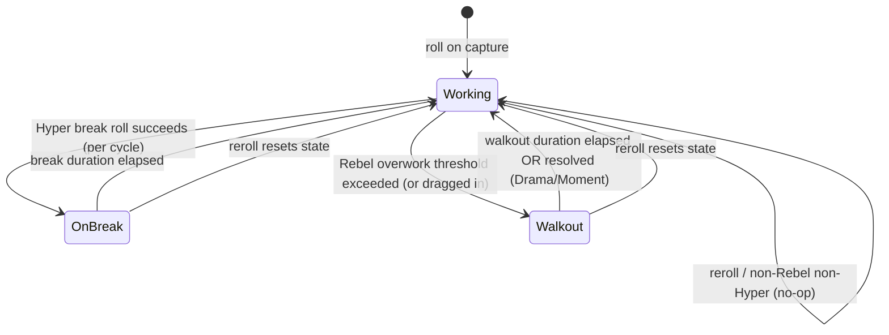

# Personality System GDD

> ⚠️ **POST-PIVOT NOTICE (2026-05-29)**: This GDD survives the Vision Pivot 2026-05-29 with **minor reconciliation**:
> - **Battle behavior tag consumer changed**: previously consumed by both Battle #5 (turn-based) + Pet AI #25 (real-time, shared contract). Now **Pet AI #25 is sole consumer** (Battle #5 cancelled). The 5 tags + params + values remain unchanged; only the runtime dispatch surface is single-engine.
> - **All other locks preserved**: 5 personality enum (Hyper/Lazy/Chaotic/Loyal/Rebel), trait table (production multipliers, break/walkout/morale params), `getBattleBehavior(id)` API, runtime state machine, F1–F5 formulas, roll weights + reroll mechanics.
> - **Implementation intact**: shipped code in `src/ServerStorage/Personality/PersonalityService.luau` requires zero changes.
>
> See `design/decisions/2026-05-29-vision-pivot.md` and `design/gdd/systems-index.md` v3.0 #2 + #25 (Pet AI as sole battle-tag consumer).

**Version**: 1.1.1 (pivot-reconciliation minor; Battle tag consumer = Pet AI only)
**Last Updated**: 2026-05-28
**Author**: systems-designer
**Status**: Draft (shipped + minor pivot reconciliation)

> **Changelog**
> - **1.1.1 (2026-05-28)** — **Phase A clarification (no schema or formula change).** Two prose clarifications for cross-system contracts surfaced by the systems-index 2026-05-28 update:
>   - **Battle behavior tags are a shared cross-system contract.** The five tags (`act_first_mistarget`, `berserk_when_last`, `random_moveset`, `bodyguard`, `counter_double`) + their params (`mistargetChance`, `defenseMultiplier`, `berserkAttackMultiplier`, `randomFromAnyMoveset`, `bodyguardAllyHpThreshold`, `bodyguardDamageTakenFraction`, `counterDamageMultiplier`) are consumed identically by **both** Battle (#5, turn-based for Raid; `battle-gdd.md` v1.3 §2.4) **and** the new Field Combat / Pet AI (#25, real-time; `pet-combat-gdd.md` planned). Personality defines the tags + numbers (§2.1, §2.2, §8 F4); each consumer implements the dispatch in its own resolution model (turn-step for Battle vs damage-tick for Pet AI). When a new tag is added here, **both** consumers must implement it; when a param value changes, both respond identically — no drift permitted. Currently Pet AI (demo `a71e545`) wires only the production-style damage multiplier — **full tag wiring is a pet-combat-gdd obligation**, NOT a Personality change.
>   - **§9 Integration Points updated** to add **System #25 (Field Combat / Pet AI)** as a `Depended On By` consumer of `getBattleBehavior(id) → {tag, params}` and the personality enum on `roster[id].personality`. Same contract Battle uses; no new API surface needed.
>   - **No change** to roll weights, behavior params, runtime state machine, F1–F5 formulas, schema, or the locked uniform-roll decision (§2.3). Reroll mid-battle rejection (E4 → `"in_battle"`) is appropriate for turn-based Battle #5; Pet AI #25 will need to define its own deferral if reroll is attempted on a currently-summoned pet (not Personality's responsibility; flagged in pet-combat-gdd).
> - **1.1 (2026-05-26)** — Cross-GDD schema reconciliation (persistence-gdd v1.1 owns the canonical shapes):
>   - **Canonical Brainrot identifier `id`.** The roster is keyed by the canonical `BrainrotEntry.id` (GUID), per persistence-gdd v1.1. Renamed all roster-key / identifier references from `guid` to `id` (data schema, runtime-state table, service/function signatures, events, remotes, formulas) so the three GDDs use one name. The value (a `HttpService:GenerateGUID(false)` string) is unchanged.
>   - **`history` consistency.** Personality persists only the `personality` enum and does not own the per-Brainrot `history` block, but where it references roster/record shape it now aligns with the canonical `id` + `history` naming.

> **Parent GDD**: `design/gdd/master-gdd.md` (planned) — Creative Pillar #1 "Brainrots are chaotic employees with real personalities."
> **System Index Entry**: `design/gdd/systems-index.md` → System #2 (Personality System, P0 Pillar).
> **Source of Truth**: `idea/brainrotInc.md` → "1. Brainrot Personality System (HIGHEST PRIORITY)" personality table.

---

## 1. Overview & Purpose

The Personality System is the **shared modifier layer** that gives every Brainrot one of five behavioral traits (Hyper, Lazy, Chaotic, Loyal, Rebel). It is **not a self-contained feature**: it stores one enum field per Brainrot and exposes a config-driven **trait table** (`PersonalityConfig`) plus a small **runtime state machine** that other systems (Idle Production, Battle, Raid, Evolution, Moment, Reroll) read to flavor their own behavior.

Its purpose is to deliver the game's core promise — *"No two bases play the same because no two Brainrots behave the same"* — at near-zero per-system implementation cost. Consumers do not branch on hardcoded personality logic; they call into this layer, pass their context (e.g. "I am computing production for Brainrot id X"), and receive a multiplier or a behavior decision.

This GDD defines: the personality enum, the roll/reroll contract, the trait-table pattern, the per-Brainrot runtime state machine (Working / OnBreak / Walkout), the formulas consumers apply, the events Personality emits (so the Moment System can listen), and the config surface. It does **not** implement any consumer system; it defines the interface each consumer reads.

---

## 2. Core Mechanics

### 2.1 The Five Personalities (source: `idea/brainrotInc.md`)

| Personality | Production Behavior | Battle Behavior |
|---|---|---|
| **Hyper** | +30% production; random "Break" (production pauses for a short window) | Always acts first; 20% chance to hit the wrong target |
| **Lazy** | -50% production; emits **morale aura** that buffs adjacent Brainrots | High defense; refuses to attack until it is the last ally standing, then goes berserk |
| **Chaotic** | Per cycle, production is either x2 or x0 (coin-flip per cycle) | Uses a random skill from any Brainrot's moveset |
| **Loyal** | Steady production; immune to negative Moment/event effects | Bodyguard: redirects incoming damage from an ally below 30% HP onto itself |
| **Rebel** | If overworked (too many Rebels co-located in one building), may **Walkout/Protest**, dragging co-located Brainrots into the Walkout | Counterattacks any hit it survives for double damage |

> **Compliance note (locked)**: Player-facing and code-facing terminology uses **"Walkout"**, **"Break"**, and **"Protest"** — never "strike" in any sense implying violence. The state machine state is named `Walkout`. Kid-safe by design.

### 2.2 Trait-Table Pattern (how consumers read Personality)

Personality is implemented as a **data layer + thin service**, not as logic embedded in each consumer.

1. `PersonalityConfig` (see Section 8) is a config table keyed by personality enum. Each entry holds **declarative numbers and flags** (multipliers, probabilities, thresholds, behavior tags) — never executable behavior.
2. A server module `PersonalityService` exposes pure query functions that read `PersonalityConfig` and the Brainrot's current runtime state:
   - `getProductionModifier(id, context) -> {multiplier: number, paused: boolean}`
   - `getBattleBehavior(id) -> {behaviorTag: string, params: table}`
   - `isImmuneToNegative(id) -> boolean`
   - `getMoraleAura(id) -> {radius: number, multiplier: number} | nil`
3. **Consumers own their effect; Personality owns the parameters.** Example: Idle Production calls `getProductionModifier`, multiplies its own base rate by the returned multiplier, and respects `paused`. Idle Production does NOT know that Hyper means "+30%" — that number lives only in config.
4. **Personality never persists derived stats.** It stores only the enum and lightweight transient runtime state (current state machine state + timers). All numeric effects are recomputed at runtime by querying the trait table. This keeps the schema tiny and makes config rebalances apply retroactively to the whole roster with no migration.
5. **Behavior tags decouple battle.** The Battle System receives a string tag (`"act_first_mistarget"`, `"bodyguard"`, `"counter_double"`, `"random_moveset"`, `"berserk_when_last"`) plus params from config, then implements the mechanic on its side. Adding a sixth personality later = a config entry + (if its battle tag is new) one handler in Battle — no change to Personality core.

### 2.3 Roll on Capture

1. When Capture finalizes a new Brainrot (server-authoritative), it calls `PersonalityService.rollPersonality()`.
2. The roll draws from `PersonalityConfig.rollWeights` (default uniform 20% each — see Section 8). Server-side RNG only; the client is told the result, never the roll.
3. The result is written to the Brainrot's `personality` field in the roster (keyed by `id` — see Section 3) and the Brainrot enters initial runtime state `Working`.
4. Capture's reveal UI displays the resulting personality (the "surprise" emotional beat). Displayed odds (Section 6) match `rollWeights` exactly (compliance + trust).

### 2.4 Reroll Contract (interface only — full system in `reroll-gdd.md`)

Personality exposes the mechanism; the Reroll System owns cost/cap/UX. The locked contract:

1. `PersonalityService.rerollPersonality(id, opts) -> newPersonality` performs an authoritative re-draw from the **same** `PersonalityConfig.rollWeights` table used at capture.
2. Reroll **replaces** the `personality` field, resets runtime state to `Working`, clears any active Break/Walkout timers, and emits a `PersonalityChanged` event (Section 5) so consumers re-read on next tick.
3. Reroll does NOT guarantee a *different* result unless `opts.guaranteeDifferent == true` (config flag `rerollGuaranteeDifferent`); by default a reroll may land the same personality (odds shown to player include this possibility).
4. Reroll while the Brainrot is mid-production or mid-battle is handled deterministically — see Edge Case E4.

### 2.5 Runtime State Machine (per Brainrot)

Personality maintains a tiny state machine **only for production-facing transient states**. Battle behavior is resolved per-turn by the Battle System via behavior tags and does not use this machine.

States:
- `Working` — default; normal production participation.
- `OnBreak` — Hyper-only transient pause; production contributes 0 while in this state.
- `Walkout` — Rebel-only transient protest; production contributes 0 and the Brainrot is flagged as having dragged/been-dragged.



Transition rules (allowed transitions; all timers use server clock):
- `Working -> OnBreak`: only if `personality == Hyper` and a per-cycle Bernoulli roll vs `breakChance` succeeds. Duration = `breakDurationSeconds`.
- `Working -> Walkout`: only if `personality == Rebel` and overwork condition holds (Section 8 / Formula F3), OR this Brainrot is dragged in by a co-located Rebel that just entered Walkout (chained per `walkoutContagionChance`).
- `OnBreak -> Working`: automatic when `now >= breakStartedAt + breakDurationSeconds`.
- `Walkout -> Working`: automatic when `now >= walkoutStartedAt + walkoutDurationSeconds`, OR forced by an external resolver (Reroll, future Drama Event). The walkout duration cap (`walkoutMaxDurationSeconds`) bounds chained walkouts.
- Any state `-> Working` on reroll (state reset).
- Lazy / Chaotic / Loyal never leave `Working` via this machine; their effects are pure production-modifier math (paused is always false).

### 2.6 Event-Driven Output (the Moment hook)

Personality is the producer of `PersonalityMoment` events. It does **not** implement the Moment System; it guarantees the event contract so Moment (and later Drama Events) can subscribe (Section 5). Every meaningful personality occurrence (Break started, Walkout started, Walkout chained, Chaotic doubled/zeroed, Loyal blocked a hit, Rebel countered) fires a `PersonalityMoment` with a typed payload. Consumers decide whether/how to surface it.

---

## 3. Data Schema

Personality **owns one persisted field** and a small block of transient runtime state. The roster container itself is owned by **System #1 Data Persistence** (`design/gdd/persistence-gdd.md`, planned); this section specifies only the Personality-owned slice and references the roster shape.

### 3.1 Persisted (DataStore — owned by Persistence, written via Persistence API)

Roster is a map keyed by `id` (the canonical `BrainrotEntry.id` GUID). Personality contributes the `personality` field.

```
roster: { [id: string]: BrainrotRecord }   -- keyed by canonical BrainrotEntry.id (GUID), persistence-gdd v1.1

BrainrotRecord (Personality-owned subset):
  personality: string   -- enum: "Hyper" | "Lazy" | "Chaotic" | "Loyal" | "Rebel"
                        -- default: result of rollPersonality() at capture (no static default)
                        -- REQUIRED; a record without this field is invalid (see E5 / migration)
```

Field detail:

| Field | Type | Default | Min/Max / Domain | Persisted? | Notes |
|---|---|---|---|---|---|
| `personality` | string (enum) | rolled at capture | one of 5 enum values | Yes (DataStore) | The ONLY personality data that persists. No derived stats stored. |

> **Schema version**: this field is introduced at `personality` schema v1. Migration policy: any legacy/corrupt record missing `personality` or holding an unknown value is repaired by re-rolling on load (see E5). The roster's own `version` field is owned by Persistence.

### 3.2 Transient Runtime State (server memory only — NOT persisted)

Held in a server-side per-session table keyed by `id`. Lost on server restart / player rejoin (re-initialized to `Working`). Intentionally ephemeral: Break/Walkout are short-lived moment-to-moment flavor, not save-worthy state.

```
runtimeState: { [id: string]: PersonalityRuntime }   -- keyed by canonical BrainrotEntry.id

PersonalityRuntime:
  state: string              -- "Working" | "OnBreak" | "Walkout"   default "Working"
  stateStartedAt: number     -- os.clock()-based server timestamp; default 0
  draggedInBy: string?       -- id of the Rebel that pulled this one into Walkout; default nil
  lastCycleOutcome: string?  -- Chaotic only: "double" | "zero" | nil; default nil (debug/Moment use)
```

| Field | Type | Default | Domain | Persisted? |
|---|---|---|---|---|
| `state` | string | `"Working"` | 3-value enum | No |
| `stateStartedAt` | number | 0 | >= 0 (server clock) | No |
| `draggedInBy` | string? | nil | id (GUID string) or nil | No |
| `lastCycleOutcome` | string? | nil | enum or nil | No |

---

## 4. Client-Server Split

| Concern | Server (authoritative) | Client (presentation only) |
|---|---|---|
| Personality roll on capture | YES — RNG, write field | Receives result for reveal animation |
| Reroll re-draw | YES — atomic re-draw + field write | Sends intent, shows result |
| Trait-table queries (modifiers, behavior tags) | YES — all consumers query server-side | Never; client may cache config for display only |
| State machine transitions (Working/OnBreak/Walkout) | YES — server clock, server timers | Receives state changes via replication for visuals |
| Overwork / break / walkout-chain rolls | YES — server RNG + server building occupancy | Never |
| `PersonalityMoment` event emission | YES | Subscribes via replicated notification for pop-ups |
| Personality icon/label/odds display | Provides data | Renders from a client-readable copy of `PersonalityConfig` display fields |

**Authority rule (locked):** every roll, reroll, multiplier, and state transition is computed on the server. `PersonalityConfig` display-only fields (name, icon, color, displayed odds, blurb) may be mirrored to the client for UI; **multipliers, probabilities, and thresholds used for resolution are read server-side only** so a tampered client cannot change outcomes. Even if a client knows the numbers, it cannot apply them — consumers ignore client-supplied effect values.

---

## 5. RemoteEvents / Functions

Personality is mostly an **internal server service**; it exposes a minimal network surface. Detailed contracts may be refined by `remotes-networking-specialist`.

### 5.1 Client → Server

| Remote | Type | Payload | Purpose | Validation |
|---|---|---|---|---|
| `RerollPersonalityRequest` | RemoteFunction (or Event w/ ack) | `{ id: string }` | Player requests a reroll (Reroll System owns cost gating; Personality performs the draw) | Server verifies caller owns `id`; rate-limited; Reroll System validates cost/cap BEFORE Personality re-draws |

> Note: Capture's personality roll has **no dedicated remote** — it happens server-side inside the Capture finalize flow and is delivered via Capture's own reveal remote.

### 5.2 Server → Client

| Remote | Type | Payload | Purpose |
|---|---|---|---|
| `PersonalityRevealed` | RemoteEvent | `{ id, personality }` | Fired on capture-finalize and on reroll-result so client plays the reveal/odds UI |
| `PersonalityStateChanged` | RemoteEvent | `{ id, state, untilServerTime }` | Notifies client of Working/OnBreak/Walkout transition for base visuals (zzz icon, protest sign) |
| `PersonalityMomentBurst` | RemoteEvent | `{ id, momentType, payload }` | Replicated surface of a `PersonalityMoment`; Moment System UI listens (thin pop-up). Personality fires; Moment formats. |

### 5.3 Internal Server Events (not network — for cross-system decoupling per gameplay-systems rule)

Bindable / signal layer (`GameEvents`), consumed by other server systems:

| Event | Payload | Fired When | Listened By |
|---|---|---|---|
| `PersonalityChanged` | `{ id, oldPersonality, newPersonality }` | After reroll commits | Idle Production, Battle, Evolution (invalidate caches) |
| `PersonalityMoment` | `{ id, momentType, personality, payload, serverTime }` | Break/Walkout/chain/Chaotic-flip/Loyal-block/Rebel-counter occurs | Moment System (primary), Drama Events (P2), Fame (P2), Analytics |
| `WalkoutStarted` | `{ id, draggedIds: {string} }` | Rebel enters Walkout (incl. chained ids) | Idle Production (zero those producers), Moment System |

`momentType` enum: `"break_started"`, `"walkout_started"`, `"walkout_chained"`, `"chaotic_double"`, `"chaotic_zero"`, `"loyal_blocked"`, `"rebel_countered"`, `"hyper_mistarget"`, `"lazy_berserk"`.

---

## 6. Player-Facing UI

Personality itself renders minimal UI; consumer systems surface most of it. Personality-owned surfaces:

1. **Capture / Reroll Reveal**: card flip showing personality icon, name, color, and one-line blurb (e.g. Hyper: "Works fast, burns out faster"). Driven by `PersonalityRevealed`.
2. **Odds Display (compliance-critical)**: on the reroll panel and capture info, show the exact per-personality probabilities from `rollWeights` as percentages summing to 100%. Must always reflect live config.
3. **Roster Tag**: each Brainrot in the roster/management panel shows its personality icon + color badge. (Roster panel itself owned by UI/HUD GDD; Personality provides the badge data.)
4. **In-Base State Visual**: small status indicator over a deployed Brainrot — `Working` (none), `OnBreak` ("Zzz"/coffee icon), `Walkout` (tiny protest sign). Driven by `PersonalityStateChanged`. Kid-safe iconography only.
5. **Moment Pop-up (data only)**: Personality supplies `momentType` + payload; the Moment System owns the actual pop-up layout and "one at a time" rule.

Mobile: all surfaces are static icons/badges + occasional event-driven pop-ups — no per-frame UI work, safe on low-end devices.

---

## 7. Edge Cases & Error States

Minimum-5 requirement exceeded. Each lists trigger → defined behavior.

- **E1 — All deployed Brainrots are Lazy (morale aura has no non-Lazy recipient).**
  Trigger: a building contains only Lazy Brainrots. The morale aura targets *adjacent* Brainrots; with no eligible recipients it has nothing to buff.
  Behavior: morale aura is computed by the recipient, not the emitter. A Brainrot only ever receives the aura if it is non-Lazy by default (config flag `moraleAuraAffectsLazy = false`). With an all-Lazy building, total production = sum of each Lazy's own -50% rate, no morale bonus applied anywhere. No error, no divide-by-zero (aura is additive, never a denominator). This is an intentionally weak ("everyone slacking") configuration, surfaced as a Moment.

- **E2 — Rebel Walkout chains until the entire building is on Walkout.**
  Trigger: one Rebel enters Walkout, drags co-located Brainrots, who (if Rebel) may further chain.
  Behavior: chaining is bounded by three config guards: (a) `walkoutContagionChance` < 1 so a chain is not guaranteed per neighbor; (b) only Brainrots in the same building are eligible (cross-building drag forbidden); (c) `walkoutMaxDurationSeconds` caps how long the whole event lasts, and (d) a per-building `walkoutCooldownSeconds` prevents immediate re-trigger after recovery. Worst case (full building Walkout) is a valid, intended "your whole factory went on Walkout" Moment — production for that building = 0 until durations elapse, then all return to `Working`. No infinite loop: contagion is evaluated once per newly-walked-out Brainrot, not recursively re-rolled on the same target.

- **E3 — Chaotic per-cycle roll when only 1 Brainrot exists / single producer.**
  Trigger: roster or building has exactly one Brainrot and it is Chaotic.
  Behavior: the x2/x0 coin-flip applies normally to that single producer. On a `zero` cycle the player's entire production for that cycle is 0 (high variance, intended). No special-casing — the formula is per-Brainrot, not relative to others, so count = 1 is valid. Mitigation is design-level (variance is the Chaotic fantasy), and a `chaotic_zero` Moment explains it so a kid doesn't think the game is broken.

- **E4 — Personality changes via reroll while the Brainrot is mid-production or mid-battle.**
  Trigger: `rerollPersonality` commits during an active production cycle or while the Brainrot is a combatant in an ongoing battle/raid.
  Behavior (locked deterministic rule):
    - Production: the **in-flight cycle finishes under the OLD personality**; the new personality applies starting from the **next** cycle boundary (no retroactive recompute of accrued pending coins). Runtime state resets to `Working` immediately, clearing any Break/Walkout (a rerolled Rebel mid-Walkout returns to work).
    - Battle/Raid: reroll is **rejected** if the Brainrot `id` is currently locked in an active battle session (server returns `error = "in_battle"`). Battle locks combatants; personality cannot change mid-fight to avoid behavior-tag desync in the turn engine.
  This prevents mid-transaction ambiguity and keeps battle deterministic/replayable.

- **E5 — Invalid or missing personality value loaded from DataStore (corruption / legacy record / unknown enum).**
  Trigger: a `BrainrotRecord` loads with `personality = nil`, `""`, or a string not in the enum.
  Behavior: on load, `PersonalityService.validateOrRepair(record)` re-rolls a fresh personality from `rollWeights`, writes it back, logs an analytics warning (`personality_repaired`), and emits `PersonalityRevealed` so the player simply sees a (re)assigned trait. Never crash, never leave an undefined enum that would break a consumer's trait-table lookup. Consumers also defensively treat an unknown personality as the config `fallbackPersonality` (default `"Loyal"` — neutral/steady) for the single tick before repair completes.

- **E6 — `rollWeights` config is invalid (weights sum to 0, contain negatives, or omit a personality).**
  Trigger: a designer edits `PersonalityConfig.rollWeights` and ships sum=0, a negative weight, or a missing key.
  Behavior: a startup config validator (`PersonalityConfig.validate()`) runs once on server boot: negatives clamped to 0 and logged; a missing key is injected at weight 0 and logged; if the total is 0 after clamping, the validator **falls back to uniform 20% across all five** and logs a critical warning. Roll never divides by zero. (Per gameplay-systems rule, validation lives in code; the numbers stay in config.)

- **E7 — Network lag / disconnect mid-reroll.**
  Trigger: client fires `RerollPersonalityRequest`, then lags or disconnects before the result returns.
  Behavior: the reroll is server-authoritative and **idempotent via an idempotency key** (provided by the Reroll System). If the server already committed the re-draw, a retry returns the same result rather than re-rolling (no double-charge, no double-roll). If the player disconnects after commit, the new personality is already persisted; on rejoin the reveal is shown from the recap. If the server had not yet committed when the connection dropped, no change occurred and no cost was taken (Reroll System charges only on commit). Runtime state simply re-initializes to `Working` on the new session.

- **E8 — Many players reroll/capture simultaneously (concurrency / scale).**
  Trigger: high concurrent roll volume across servers.
  Behavior: rolls are per-Brainrot and per-server; there is no shared mutable global state in Personality, so there is no cross-player contention. Each roll uses server RNG seeded per-call. DataStore writes for the `personality` field go through Persistence's atomic `UpdateAsync` path (Persistence GDD owns retry/backoff). Personality adds no global lock. Scales linearly.

---

## 8. Balancing Parameters

All tunable values live in `PersonalityConfig` (proposed path: `src/ReplicatedStorage/Shared/Config/PersonalityConfig.lua`). **Zero magic numbers in code** — every multiplier, probability, and threshold below is read from this table. Display-only sub-fields (name/icon/color/blurb/displayed odds) may be mirrored to client; resolution fields are read server-side only (Section 4).

```lua
-- src/ReplicatedStorage/Shared/Config/PersonalityConfig.lua
--
-- Trait table for the Personality System (Pillar). Edited by designers for balance.
-- Consumers (Idle Production, Battle, Raid, Evolution, Moment, Reroll) READ this table;
-- they never hardcode personality numbers. No derived stats are stored on Brainrots.
-- Schema version: 1

return {
    version = 1,

    -- Personality enum keys. Order here is the canonical UI display order.
    -- Domain: exactly these 5 keys must exist (validator enforces).
    order = { "Hyper", "Lazy", "Chaotic", "Loyal", "Rebel" },

    -- Roll weights used by BOTH capture-roll and reroll (same table, locked).
    -- Each weight is relative; probability = weight / sum(weights).
    -- Range per weight: 0..1000 (integers recommended). Default: uniform.
    -- Displayed odds in UI MUST be derived from these exact weights.
    rollWeights = {
        Hyper   = 20,  -- default 20  -> 20% at uniform
        Lazy    = 20,  -- default 20  -> 20%
        Chaotic = 20,  -- default 20  -> 20%
        Loyal   = 20,  -- default 20  -> 20%
        Rebel   = 20,  -- default 20  -> 20%
    },

    -- If a reroll must always differ from current personality.
    -- Default false (a reroll may return the same; odds shown include this).
    rerollGuaranteeDifferent = false,

    -- Used by consumers for one defensive tick if an enum is unknown (see E5).
    -- Range: any valid personality key. Default "Loyal" (neutral/steady).
    fallbackPersonality = "Loyal",

    -- Per-personality trait definitions.
    traits = {

        Hyper = {
            name = "Hyper",                 -- display
            color = "#FF5A3C",              -- display (badge)
            blurb = "Works fast, burns out faster",  -- display (move to localization at impl)

            -- PRODUCTION
            -- Multiplier applied to base production rate by Idle Production.
            -- Range: 0.0..3.0. Default 1.30 (= +30% per source doc).
            productionMultiplier = 1.30,
            -- Per production cycle, chance to enter OnBreak (Bernoulli).
            -- Range: 0.0..1.0. Default 0.10 (occasional break).
            breakChance = 0.10,
            -- How long a Break lasts (production = 0 during it). Server seconds.
            -- Range: 5..120. Default 20.
            breakDurationSeconds = 20,

            -- BATTLE
            battleBehaviorTag = "act_first_mistarget",
            -- Chance the first-strike hits the WRONG target.
            -- Range: 0.0..1.0. Default 0.20 (= 20% per source doc).
            mistargetChance = 0.20,
        },

        Lazy = {
            name = "Lazy",
            color = "#7B8794",
            blurb = "Slow worker, somehow motivates everyone else",

            -- PRODUCTION
            -- Range: 0.0..3.0. Default 0.50 (= -50% per source doc).
            productionMultiplier = 0.50,
            -- Morale aura buffs ADJACENT non-Lazy Brainrots' production.
            moraleAura = {
                -- Multiplier added to each affected neighbor's rate.
                -- Range: 1.0..2.0. Default 1.15 (+15% to neighbors).
                neighborMultiplier = 1.15,
                -- Adjacency radius in "slots" within the same building.
                -- Range: 1..8. Default 1 (immediate neighbors).
                radiusSlots = 1,
            },
            -- Whether Lazy can receive another Lazy's aura (see E1).
            -- Default false (Lazy never buffed; avoids all-Lazy stacking).
            moraleAuraAffectsLazy = false,

            -- BATTLE
            battleBehaviorTag = "berserk_when_last",
            -- Defense multiplier while NOT last-standing (high defense).
            -- Range: 1.0..3.0. Default 1.75.
            defenseMultiplier = 1.75,
            -- Attack multiplier once it is the LAST ally alive (berserk).
            -- Range: 1.0..4.0. Default 2.50.
            berserkAttackMultiplier = 2.50,
        },

        Chaotic = {
            name = "Chaotic",
            color = "#B14DFF",
            blurb = "Genius or disaster, never both",

            -- PRODUCTION (per-cycle coin flip; multiplier is double or zero)
            productionMultiplier = 1.0, -- base (modified by the flip below)
            -- Probability the cycle is the DOUBLE outcome (else ZERO).
            -- Range: 0.0..1.0. Default 0.50 (fair coin per source doc).
            doubleChance = 0.50,
            -- Multiplier on a "double" cycle. Range: 1.0..4.0. Default 2.0.
            doubleMultiplier = 2.0,
            -- Multiplier on a "zero" cycle. Range: 0.0..1.0. Default 0.0.
            zeroMultiplier = 0.0,

            -- BATTLE
            battleBehaviorTag = "random_moveset",
            -- If Chaotic may pull skills from ANY Brainrot's moveset (else own).
            -- Default true (per source doc: "from any Brainrot's moveset").
            randomFromAnyMoveset = true,
        },

        Loyal = {
            name = "Loyal",
            color = "#2EC4B6",
            blurb = "Dependable. Takes the hit for the team.",

            -- PRODUCTION
            -- Range: 0.0..3.0. Default 1.0 (steady).
            productionMultiplier = 1.0,
            -- Immune to negative Moment/event production effects.
            -- Default true (per source doc).
            immuneToNegativeEvents = true,

            -- BATTLE
            battleBehaviorTag = "bodyguard",
            -- Redirect ally damage when ally HP fraction is below this.
            -- Range: 0.0..1.0. Default 0.30 (= below 30% per source doc).
            bodyguardAllyHpThreshold = 0.30,
            -- Fraction of the redirected hit Loyal actually takes.
            -- Range: 0.0..1.0. Default 1.0 (takes full hit).
            bodyguardDamageTakenFraction = 1.0,
        },

        Rebel = {
            name = "Rebel",
            color = "#FFB627",
            blurb = "Won't be overworked. Brings friends.",

            -- PRODUCTION
            -- Range: 0.0..3.0. Default 1.0 (normal unless on Walkout).
            productionMultiplier = 1.0,
            -- "Overworked" threshold: number of Rebels co-located in ONE building
            -- at/above which Walkout becomes possible.
            -- Range: 1..50. Default 3.
            overworkRebelCount = 3,
            -- Per-eligibility-check chance an overworked Rebel starts a Walkout.
            -- Range: 0.0..1.0. Default 0.15.
            walkoutChance = 0.15,
            -- Chance a co-located Brainrot is dragged into an active Walkout.
            -- Range: 0.0..1.0. Default 0.40. (<1 bounds chains — see E2.)
            walkoutContagionChance = 0.40,
            -- How long a single Walkout lasts. Server seconds.
            -- Range: 30..1800. Default 300 (5 min, matches drama-event flavor).
            walkoutDurationSeconds = 300,
            -- Hard cap on total chained-walkout duration per building (safety).
            -- Range: 60..3600. Default 600.
            walkoutMaxDurationSeconds = 600,
            -- Cooldown after a building's Walkout resolves before it can recur.
            -- Range: 0..7200. Default 600.
            walkoutCooldownSeconds = 600,

            -- BATTLE
            battleBehaviorTag = "counter_double",
            -- Damage multiplier on a survived-hit counterattack.
            -- Range: 1.0..4.0. Default 2.0 (= double per source doc).
            counterDamageMultiplier = 2.0,
        },
    },
}
```

### Formulas (explicit, named variables)

**F1 — Production multiplier resolution (consumed by Idle Production).**
For a Brainrot `b` in building, the effective per-cycle production:

```
effectiveRate(b) = baseRate(b)
                 * personalityMult(b)
                 * chaoticCycleFactor(b)
                 * moraleFactor(b)
                 * (paused(b) ? 0 : 1)

Where:
  baseRate(b)          = Idle Production's own base rate for b      (owned by Idle Production)
  personalityMult(b)   = traits[b.personality].productionMultiplier  (1.30 Hyper / 0.50 Lazy / 1.0 others)
  chaoticCycleFactor(b)= if b.personality == "Chaotic":
                            rollCoin(doubleChance) ? doubleMultiplier : zeroMultiplier
                          else 1.0
  moraleFactor(b)      = if b is non-Lazy AND >=1 Lazy neighbor within radiusSlots:
                            moraleAura.neighborMultiplier      (1.15)
                          else 1.0
  paused(b)            = (runtimeState[b].state == "OnBreak")  -- Hyper break
                          OR (runtimeState[b].state == "Walkout") -- Rebel walkout/dragged
```

Bounds: `effectiveRate >= 0` always (zero-floored by `zeroMultiplier`/`paused`). No upper overflow risk since all multipliers are config-bounded (max product ≈ baseRate * 1.30 * 2.0 * 1.15 ≈ baseRate * 2.99). If `immuneToNegativeEvents` (Loyal), any externally-applied negative production modifier is skipped before this formula runs.

**F2 — Hyper break roll (per production cycle, state machine).**
```
if b.personality == "Hyper" and runtimeState[b].state == "Working":
    if random() < breakChance:        -- breakChance = 0.10
        transition(b, "OnBreak"); stateStartedAt = now
        emit PersonalityMoment("break_started")
if runtimeState[b].state == "OnBreak" and now >= stateStartedAt + breakDurationSeconds:
    transition(b, "Working")
```

**F3 — Rebel overwork / Walkout trigger + contagion (state machine).**
```
rebelCountInBuilding = count of Rebels co-located in the same building
isOverworked(b)      = (b.personality == "Rebel") and (rebelCountInBuilding >= overworkRebelCount)

-- trigger (evaluated per eligibility check while Working, building not on cooldown):
if isOverworked(b) and random() < walkoutChance:
    transition(b, "Walkout"); stateStartedAt = now
    draggedSet = {}
    for each co-located neighbor n (n != b, n.state == "Working"):
        if random() < walkoutContagionChance:    -- 0.40
            transition(n, "Walkout"); n.draggedInBy = b.id
            draggedSet += n
    emit WalkoutStarted({ id = b.id, draggedIds = draggedSet })
    emit PersonalityMoment("walkout_started")

-- recovery:
if b.state == "Walkout" and now >= stateStartedAt + min(walkoutDurationSeconds, walkoutMaxDurationSeconds):
    transition(b, "Working"); start building walkoutCooldownSeconds
```
Contagion is evaluated **once per newly-walked-out Brainrot**, never recursively re-rolled on the same target — guarantees termination (see E2).

**F4 — Battle behavior resolution (consumed by Battle System via tag).**
Personality returns `{ tag, params }`; Battle applies. Per-tag damage/decision math:
```
-- Hyper "act_first_mistarget":
turnOrderPriority(b) = +INF (acts first)          -- Battle sorts by this
chosenTarget(b)      = random() < mistargetChance ? randomOtherTarget() : intendedTarget()

-- Lazy "berserk_when_last":
incomingDamageTaken(b) = rawDamage / defenseMultiplier         -- while allies remain
attackDamage(b)        = (alliesAlive == 1) ? baseAtk * berserkAttackMultiplier : 0  -- won't attack until last

-- Chaotic "random_moveset":
skillThisTurn(b) = randomFromAnyMoveset ? pickRandom(allCombatants.movesets) : pickRandom(b.moveset)

-- Loyal "bodyguard":
if existsAlly a with hpFraction(a) < bodyguardAllyHpThreshold and a is targeted:
    redirect a's incoming hit to b; b takes rawDamage * bodyguardDamageTakenFraction

-- Rebel "counter_double":
if b survives an incoming hit (hpAfter > 0):
    counterDamage = b.baseAtk * counterDamageMultiplier      -- dealt to attacker
```
All right-hand constants come from `traits[...]`. Battle owns `baseAtk`, `rawDamage`, HP, moveset — Personality owns only the multipliers/flags/tags.

**F5 — Roll / odds.**
```
sum = Σ rollWeights[k] for k in order
probability(k) = rollWeights[k] / sum          -- shown in UI exactly
rollPersonality():
    r = random() * sum
    accumulate weights in `order`; return first k where running total > r
rerollPersonality(id):
    p = rollPersonality()
    if rerollGuaranteeDifferent and p == current: re-draw excluding current
    return p
```
If `sum == 0` after validation clamping, the validator already substituted uniform weights (E6), so `sum` is never 0 at runtime.

---

## 9. Integration Points

### Depends On
- **System #1 — Data Persistence & Roster Core** (`design/gdd/persistence-gdd.md`): owns the `id`-keyed roster (canonical `BrainrotEntry.id`, GUID) and the atomic write path for the `personality` field; owns schema versioning/migration into which Personality's repair logic (E5) hooks. Personality stores no data itself beyond contributing one field.

### Depended On By (consumers that READ the trait table / listen to events)
- **System #3 — Idle Production**: reads `getProductionModifier` / morale aura; respects `paused` (OnBreak/Walkout); applies F1; listens to `WalkoutStarted` and `PersonalityChanged`.
- **System #4 — Capture**: calls `rollPersonality()` on finalize; drives `PersonalityRevealed`.
- **System #5 — Battle System** (`battle-gdd.md` v1.3): reads `getBattleBehavior` (tags + params); applies F4; honors the in-battle reroll lock (E4); deterministic/replayable. **Turn-based dispatch context** — see also #25 (real-time dispatch of the same tags).
- **System #6 — Raid v1** (`raid-gdd.md` v1.1): inherits Battle's personality behavior (raids use battle resolution); defense flavor (Loyal guards, Rebel fights harder if overworked) flows through F4. Unaffected by #25 — raids stay turn-based.
- **System #8 — Work-Based Evolution + Level/XP** (`evolution-gdd.md` v1.3): reads `personality` to pick the Axis A evolution branch (Hyper→Senior Hyper, Rebel→Revolutionary, Loyal→Guardian, etc.); may listen to Moments for milestone flavor. **Reroll preserves Axis B `level`/`xp`** identically to how it preserves `evoStage` (E3-aligned logic on Evolution's side).
- **System #25 — Field Combat / Pet AI** (`pet-combat-gdd.md` planned; demo `a71e545`) — **NEW v1.1.1.** Reads `getBattleBehavior` (same API Battle uses; identical `{tag, params}` payload) for real-time field-combat dispatch. The five tags + params (§2.4, §8 F4) apply identically; only the runtime dispatch differs (damage-tick instead of turn-step). Reads `roster[id].personality` for the summoned-fighter's identity + damage multiplier (currently only the production-style `prodMult` is wired in demo; full tag wiring is a pet-combat-gdd obligation). Personality has **no special handling** for #25 — same contract as Battle.
- **System #11 — Reroll Personality**: calls `rerollPersonality()` (owns cost/cap/odds-UI; Personality owns the draw + field write + `PersonalityChanged`).
- **System #12 — Moment System**: primary listener of `PersonalityMoment` / `PersonalityMomentBurst`; formats and surfaces bursts (one at a time). Personality defines the contract only; Moment owns presentation/recap.
- **Phase 2 — Drama Events (#22), Fame/Trending (#21)**: also listen to `PersonalityMoment` (interactive choices / fame sources). No change required in Personality core to add them.

### Resolution notes (no contradictions)
- Production numbers (+30% / -50% / x2-x0) and battle behaviors are transcribed directly from `idea/brainrotInc.md` and formalized into config + formulas here. No divergence introduced.
- "Strike" from the source doc is intentionally re-termed **Walkout/Break/Protest** per the locked compliance constraint; this is a terminology change only, behavior is preserved.
- Personality holds the pillar's *numbers and contracts*; the *felt* surface (Moments, Drama) is owned by their respective GDDs — consistent with systems-index notes ("shared modifier layer, not a self-contained feature").

---

## Acceptance Criteria (system is "done")

- [ ] Every Brainrot record persists exactly one `personality` enum field; no derived stats stored.
- [ ] Roll and reroll draw from the same `rollWeights`; UI odds match config exactly and sum to 100%.
- [ ] All multipliers/probabilities/thresholds are read from `PersonalityConfig`; grep of consumer code finds zero hardcoded personality numbers.
- [ ] Runtime state machine enforces only the allowed transitions (Working/OnBreak/Walkout) using server clock.
- [ ] `PersonalityMoment`, `PersonalityChanged`, `WalkoutStarted` events fire with the specified payloads and are observable by a test subscriber.
- [ ] Reroll is server-authoritative + idempotent and is rejected mid-battle (E4) and never double-charges/double-rolls (E7).
- [ ] Config validator boots cleanly and recovers from invalid `rollWeights` to uniform (E6); load-time repair handles unknown/missing enum (E5).
- [ ] Walkout chaining provably terminates and is bounded by duration/cooldown caps (E2).
- [ ] Formulas F1–F5 implemented as written; production never negative, never overflows config-bounded maximum.
- [ ] Client receives personality + state purely for display; tampering a client cannot alter a roll or an applied multiplier (Section 4).
- [ ] Works on low-end mobile (icons/badges + event pop-ups only; no per-frame personality UI).
