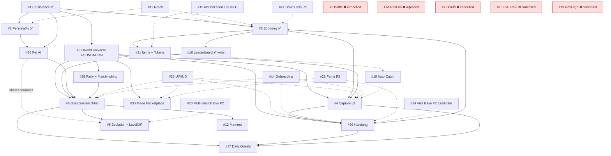

# Systems Index — Brainrot Inc.

**Version**: 3.0 (Vision Pivot rewrite)
**Last Updated**: 2026-05-29
**Author**: game-designer
**Status**: Locked post-pivot

> **Anchor**: `design/decisions/2026-05-29-vision-pivot.md` — this systems index is the implementation map for the locked vision pivot.
>
> **What this index represents**: the **canonical current state** of the game system catalogue post-2026-05-29 vision pivot. Prior versions (v1/v2) tracked an idle-game + NPC-raid + future-PvP vision that has been **superseded**. See git history for prior content; see the Vision Pivot Doc for the audit trail of what changed and why.

> **Revision note (2026-05-29, v3.0 rewrite)**: **Game vision pivot**. New genre: multi-place creature hunter (Pokémon GO + Adopt Me DNA) with idle Kandang economy + 3-tier boss progression + peer-to-peer trade. **5 systems obsoleted** (Battle #5, Raid #6, Raid Shield #7, PvP Raid #18, Revenge #19 — see Cancelled Systems section). **7 new MVP systems** added (World Universe, Kandang, Boss System, Capture v2, Items+Token, Party+Matchmaking, Trade Marketplace). **System numbers retained for stable identifier integrity** — cancelled systems keep their slot with `(CANCELLED)` marker.

## Summary

- **Total active MVP systems**: 23 (after restructure)
- **Active Phase 2 systems**: 3 (Fame, Visit Base, Brain Cells)
- **Cancelled systems** (post-pivot): 5
- **Implemented + shipped**: 3 (#1 Persistence, #2 Personality, #9 Economy)
- **In design** (GDD shipped, code pending): 2 (#25 Pet AI, #26 Kandang/Showroom pending rename)
- **Not started**: 18

**Legend** — Priority tiers: P0 = foundation/blocker, P1 = core MVP, P2 = MVP-supporting, P3 = Phase 2. Risk: L/M/H.

**World context** (post-pivot): Setting = "The Feed" (internet-as-place). Hub = **Lobby place** (social square, shop, trade, leaderboard, party formation). Players teleport to **Areas** for hunting wild Brainrots + Colony Boss, to **Super Boss zones** for Tier-2 boss encounters, to **Raid Dungeons** for token-gated Tier-3 raids, and to their **Kandang** (private sub-place) for idle production.

---

## Active Systems (MVP)

### 1. Data Persistence & Roster Core
- **Status**: ✅ **Shipped** (commit a71e545 + ADR-001/002)
- **Phase**: MVP
- **Priority**: P0 (foundation)
- **Value**: 5 | **Effort**: 4 | **Risk**: H | **Monetization**: 3
- **GDD**: `design/gdd/persistence-gdd.md` v1.4.1
- **Depends On**: (none — foundation)
- **Depended On By**: everything
- **Notes**: GUID-keyed roster, session locking, schema v1 + migrations, atomic mutation path, txLog idempotency, 8h offline cap. **Vision-pivot extension needed (post-2026-05-29)**: cross-place `TeleportData` handoff design for multi-place architecture (see §27 World Universe). Code intact; documentation extension only.

### 2. Personality System (PILLAR)
- **Status**: ✅ **Shipped** (commit 6f5d4c6)
- **Phase**: MVP
- **Priority**: P0 (pillar — gates flavor of all other systems)
- **Value**: 5 | **Effort**: 3 | **Risk**: M | **Monetization**: 4
- **GDD**: `design/gdd/personality-gdd.md` v1.1.1
- **Depends On**: Data Persistence
- **Depended On By**: Idle/Kandang, Capture, Pet AI #25 (boss combat — battle behavior tags), Evolution, Reroll
- **Notes**: 5 personalities (Hyper / Lazy / Chaotic / Loyal / Rebel). Trait table + behavior tag dispatch — survives pivot unchanged. Behavior tags now consumed exclusively by Pet AI #25 (Battle #5 cancelled).

### 3. Economy / Currency (Meme Coins)
- **Status**: ✅ **Shipped** (commit ef5bd88, locked v1.3)
- **Phase**: MVP
- **Priority**: P1 (currency backbone)
- **Value**: 4 | **Effort**: 2 | **Risk**: M | **Monetization**: 4
- **GDD**: `design/gdd/economy-gdd.md` v1.3 — **extension needed** for new sinks (Capture Items, Raid Token DevProduct)
- **Depends On**: Data Persistence
- **Depended On By**: Capture v2, Boss System (loot), Reroll, Trade, Kandang upgrades, Auto-Catch, Daily Quests, Pet AI #25
- **Notes**: Wallet API + faucet/sink discipline + DevProduct ladder + 3 GamePass SKUs all carry forward. **Post-pivot extensions**:
  - **NEW faucets**: `boss_kill_drop` (item/Brainrot), Pokémon-GO-style `pokestop_reward` if introduced
  - **NEW sinks**: `capture_item_purchase`, `raid_token_purchase` (DevProduct mirror), `trade_fee` (if Stardust analogue uses coins)
  - **OBSOLETED**: `raid_loot` faucet + `raid_send` sink (replaced by boss kill drops + token consumption)
  - **OBSOLETED lock**: `raidLootPct = 0.20` (cancelled — boss raid mechanic different)
  - Anti-pattern telemetry + wallet pressure curve survive intact (mostly relevant in new context)

### 4. Capture v2 (Item-based instant capture, area-tier)
- **Status**: Not started (replaces old Capture #4 v1.3 — that GDD will be moved to archive)
- **Phase**: MVP
- **Priority**: P1 (core hunt loop)
- **Value**: 5 | **Effort**: 3 (simpler than old explore-map design) | **Risk**: M | **Monetization**: 4
- **GDD**: `design/gdd/capture-v2-gdd.md` (planned)
- **Depends On**: World Universe (#27), Persistence (#1), Personality (#2), Economy (#3, for Capture Items shop)
- **Depended On By**: Kandang (#26 deployment supply), Boss System (#6 roster combat), Evolution (#8)
- **Notes**: **New mechanic**: player buys area-tier Capture Items (`Forest Item`, `Cave Item`, `Sky Item`, etc.) from Lobby shop. In an Area sub-place, approach wild Brainrot → use item → **instant capture** (success rate possibly scales with item tier vs Brainrot rarity). **No fight required for capture** — Pet AI is reserved for boss combat only (per Vision Pivot Doc Decision 4). Naming: each area has theme-specific item name. Roster cap = 200 (persistence-owned). Old "explore-map vs crate fallback" tension dissolved — Areas are the explore-map, item-based capture replaces timing minigame.
- **Open**: capture item success rate formula (flat per-tier vs rarity-scaled); item tier pricing.

### 5. Battle System (CANCELLED)
- **Status**: ❌ **CANCELLED** (Vision Pivot 2026-05-29) — turn-based combat engine has no remaining use case
- **GDD**: `design/gdd/battle-gdd.md` v1.3 → `design/gdd/archive/battle-gdd.md` (pending move)
- **Reason**: All combat in new vision is real-time via Pet AI (#25). Vision Pivot Doc Decision 4 promotes Pet AI to pillar combat engine for all 3 boss tiers; turn-based has no remaining caller.
- **Carried into Pet AI #25**: Battle's `levelScale(L)` formula, the 5 personality battle tags, knock-out vocabulary lock. These survive in `pet-combat-gdd.md` v1.0 §8.

### 6. Boss System (3-tier, replaces old Raid v1)
- **Status**: Not started (replaces old Raid #6 v1.2 — that GDD will be moved to archive)
- **Phase**: MVP
- **Priority**: P1 (post-capture progression spine)
- **Value**: 5 | **Effort**: 4 | **Risk**: M | **Monetization**: 3
- **GDD**: `design/gdd/boss-system-gdd.md` (planned)
- **Depends On**: Pet AI (#25), World Universe (#27), Capture v2 (#4), Persistence (#1), Economy (#3, loot + tokens), Party System (#29, for co-op tiers)
- **Depended On By**: Evolution (#8, win milestones), Daily Quests (#17), Moment System (#12), Leaderboard (#16)
- **Notes**: **3-tier structure** (per Vision Pivot Decision 3):
  - **Tier 1 — Colony Boss**: spawns in shared Area sub-place alongside regular Brainrots. **Solo-able** (Pet AI summons), co-op bonus rewards (Decision 5). Drops **Rare** Brainrot (chance per kill).
  - **Tier 2 — Super Boss** (working name `CEO Brainrot` — confirm naming): standalone sub-place per Super Boss, no regular spawns. **Party-instanced** — enter solo or with party, dedicated instance (Decision 6). Drops **Epic** Brainrot (high chance / guaranteed per kill, weekly cooldown TBD).
  - **Tier 3 — Raid Boss**: token-gated instanced Raid Dungeon. **Solo or party (player choice)**. Token consumed per attempt (Decision 7). Drops **Legendary** Brainrot (unique-to-this-source).
- **Open**: Super Boss name lock; Colony HP scaling rule; spawn cadence (always-on / scheduled / cooldown); refund-on-fail for tokens.

### 7. Raid Shield (CANCELLED)
- **Status**: ❌ **CANCELLED** (Vision Pivot 2026-05-29)
- **GDD**: not authored (was planned, never written)
- **Reason**: PvP base-raid mechanic cancelled (Vision Pivot Doc Decision context). No defending vs other players → no shield function.

### 8. Work-Based Evolution + Level/XP Progression
- **Status**: Not started (GDD locked, no code yet)
- **Phase**: MVP
- **Priority**: P2 (long-term hook)
- **Value**: 4 | **Effort**: 3 | **Risk**: M | **Monetization**: 2
- **GDD**: `design/gdd/evolution-gdd.md` v1.3
- **Depends On**: Persistence, Personality, **Pet AI #25** (XP source via boss-win), Kandang (lifetime coin milestones)
- **Depended On By**: Moment System, Phase 2 Multi-Branch Evolution
- **Notes**: Two orthogonal axes (Axis A work-based milestone + Axis B Level/XP) survive pivot. Level/XP source = boss kills (was raid wins + field combat wins, now both via Pet AI's boss engine). No GDD change needed; mostly just nominal source rename in §9.

### 9. (Reserved — see Economy / Currency at slot #3)

### 10. Auto-Catch (Hybrid: free unlock + GamePass upgrade)
- **Status**: Not started
- **Phase**: MVP
- **Priority**: P2 (convenience / monetization)
- **Value**: 3 | **Effort**: 3 | **Risk**: M | **Monetization**: 4
- **GDD**: `design/gdd/auto-catch-gdd.md` (planned)
- **Depends On**: Capture v2 (#4), Persistence, Monetization (#15), Economy (#3 for Capture Items)
- **Notes**: **Adapted to new capture model**: Auto-Catch automates the item-use loop — player has Capture Items in inventory + Auto-Catch toggle, server auto-uses items on encountered wild Brainrots. Player still pays per item (no free auto-magic). Unlocks free at ~50 manual captures. GamePass upgrade speeds frequency/intelligence.

### 11. Reroll Personality
- **Status**: Not started
- **Phase**: MVP
- **Priority**: P2 (depth + monetization)
- **Value**: 3 | **Effort**: 2 | **Risk**: L | **Monetization**: 4
- **GDD**: `design/gdd/reroll-gdd.md` (planned)
- **Depends On**: Personality, Economy, Persistence
- **Notes**: Capped ladder {250/600/1200/2000} + 24h reset (LOCKED). Survives pivot unchanged. Robux shortcut (Reroll Pass) defers to Monetization #15.

### 12. Moment System (Online burst + Offline recap)
- **Status**: Not started
- **Phase**: MVP
- **Priority**: P2
- **Value**: 4 | **Effort**: 3 | **Risk**: M | **Monetization**: 1
- **GDD**: `design/gdd/moment-system-gdd.md` (planned)
- **Depends On**: Personality, Pet AI #25 (boss win moments), Kandang (idle Walkout/Break), Evolution, Persistence
- **Depended On By**: Visit Base (#24)
- **Notes**: **Adapted post-pivot**: Moments now surface boss kill recaps, CEO encounter highlights, Legendary drops from Raid Dungeon — in addition to existing Kandang break/walkout/zoom flavor. The viral "Show me your evolved Brainrot" hook surfaces here on offline return + during co-op raid spectator.

### 13. UI / HUD
- **Status**: Not started
- **Phase**: MVP
- **Priority**: P1
- **Value**: 4 | **Effort**: 4 | **Risk**: M | **Monetization**: 2
- **GDD**: `design/gdd/ui-hud-gdd.md` (planned)
- **Depends On**: Economy (currency), Persistence (roster), most systems (each panel)
- **Notes**: Mobile-first. **Adapted post-pivot**: lobby HUD (coin balance, party invite, shop button, trade button, leaderboard, portals to Areas/Bosses/Dungeon), area HUD (mini-map of wilds, capture item picker), Kandang HUD (idle ticker, deploy/recall), boss combat HUD (Pet AI summons + boss HP bar), trade UI (offer panel, confirmation).

### 14. Onboarding / FTUE
- **Status**: Not started
- **Phase**: MVP
- **Priority**: P1
- **Value**: 5 | **Effort**: 3 | **Risk**: M | **Monetization**: 1
- **GDD**: `design/gdd/onboarding-gdd.md` (planned)
- **Depends On**: Capture v2, Personality, Kandang, Economy, UI/HUD, World Universe
- **Notes**: **Rewritten flow post-pivot**: spawn in Lobby → tour buttons → teleport to first Area → buy Forest Item from kiosk → capture first wild (instant reveal moment, personality pillar lands here) → teleport to private Kandang → deploy Brainrot for idle production → return to Lobby → teleport to Boss Zone → first Colony Boss (Pet AI summon tutorial) → reward. End of FTUE: player has 1-3 Brainrots captured, basic Kandang earning, first Colony Boss kill, awareness of shop + lobby social. Step thresholds/rewards config-driven.

### 15. Monetization (GamePass + DevProduct, zero P2W)
- **Status**: SKU table LOCKED (`economy-gdd.md` v1.3 §10.4 + 2026-05-29 lock); full system implementation Not started. **Post-pivot extension**: add Raid Token DevProduct ladder.
- **Phase**: MVP
- **Priority**: P1
- **Value**: 3 | **Effort**: 3 | **Risk**: M | **Monetization**: 5
- **GDD**: `design/gdd/monetization-gdd.md` (planned — adopt the §10.4 SKU table from economy-gdd v1.3 + new Token DevProduct)
- **Depends On**: Persistence, Economy, Auto-Catch, Reroll, **Raid Boss (#6 Tier 3) tokens**
- **Notes**: **Launch SKU ladder LOCKED v1.3** + Vision Pivot extension:
  - 3 GamePasses: **2x Offline Earnings @ 199 R**, **Extra Roster Slots +50 @ 299 R**, **Auto-Catch toggle @ 399 R**
  - 4 Meme Coins Packs: **15K/50K/150K/500K @ 49/99/249/599 R**
  - **NEW: Raid Token DevProduct ladder** (per Vision Pivot Decision 7) — pricing TBD (e.g. 1 token @ 49 R, 5 tokens @ 199 R)
  - **CANCELLED SKU**: Extended Raid Shield (no shield function in new vision)
  - **Anti-recommendation (DO NOT ship)**: skip-reroll-cooldown, buy-specific-Brainrot, boost-raid-power, loot boxes / premium currency gacha. **Plus: tokens must not bypass content gating** — DevProduct tokens grant raid attempt FREQUENCY only, not combat power (zero-P2W check per Decision 7).
  - Receipt processing must be idempotent + server-authoritative (persistence v1.4 §2.3a).

### 16. Leaderboard (Richest Manager)
- **Status**: Write side ✅ shipped (commit ef5bd88, `LeaderboardWriteBootstrap`); read side + UI Not started
- **Phase**: MVP
- **Priority**: P2
- **Value**: 3 | **Effort**: 2 | **Risk**: L | **Monetization**: 1
- **GDD**: `design/gdd/leaderboard-gdd.md` (planned)
- **Depends On**: Persistence, Economy
- **Notes**: OrderedDataStore `Leaderboard_RichestManager_v1`, key per UserId, value = `stats.totalCoinsEarned`. Survives pivot unchanged. **Phase 2 extensions**: add Legendary-count leaderboard, Boss-kill leaderboard, Trader-volume leaderboard.

### 17. Daily Quests (Objectives)
- **Status**: Not started
- **Phase**: MVP
- **Priority**: P2 (retention)
- **Value**: 3 | **Effort**: 3 | **Risk**: M | **Monetization**: 2
- **GDD**: `design/gdd/daily-quests-gdd.md` (planned)
- **Depends On**: Economy, Persistence, **Boss System (#6)**, Capture v2 (#4), Kandang (#26), Pet AI (#25)
- **Notes**: 3 daily quests rolled at server-clock reset. **Quest pool adapted post-pivot**: "tangkap N Brainrot di [area]", "menang M Colony Boss", "kalahkan 1 CEO Brainrot mingguan", "kumpulkan X coins di Kandang", "level-up 1 Brainrot", "complete 1 Raid Dungeon". Reward = Meme Coins + occasionally Capture Items / Raid Tokens (per Vision Pivot Decision 7 — quest as a token source). Reward pool per-quest config range.

### 18. PvP Raids (CANCELLED)
- **Status**: ❌ **CANCELLED** (Vision Pivot 2026-05-29)
- **Reason**: Owner pivoted away from async open base-PvP. All raid mechanic re-targeted to PvE boss raid (System #6).

### 19. Revenge System (CANCELLED)
- **Status**: ❌ **CANCELLED** (Vision Pivot 2026-05-29)
- **Reason**: Coupled to PvP Raids #18 which is cancelled.

### 20. Multi-Branch Evolution
- **Status**: Not started — Phase 2
- **Priority**: P3
- **Value**: 4 | **Effort**: 3 | **Risk**: M | **Monetization**: 2
- **Depends On**: Evolution (#8)
- **Notes**: Multiple evolution paths per personality based on play history. Survives pivot unchanged (still relevant for late-game).

### 21. Premium Currency (Brain Cells) — Phase 2
- **Status**: Not started — Phase 2
- **Priority**: P3
- **Value**: 2 | **Effort**: 2 | **Risk**: M | **Monetization**: 5
- **Notes**: `gems` field pre-provisioned default 0. Phase 2 only. Survives pivot.

### 22. Fame / Trending System
- **Status**: Not started — Phase 2 (could promote to MVP if peer-trade social layer requires it; defer for now)
- **Priority**: P3
- **Value**: 4 | **Effort**: 4 | **Risk**: H | **Monetization**: 2
- **Depends On**: Personality, Visit Base (#24), Leaderboard, Trade Marketplace (#30)
- **Notes**: Likes-based reputation + Trending leaderboard. Phase 2 post-launch addition.

### 23. (Reserved)

### 24. Visit Base (Read-Only Async Social) — Phase 2 candidate for MVP
- **Status**: Not started — Phase 2 (consider MVP promotion)
- **Priority**: P3 (currently)
- **Value**: 3 | **Effort**: 4 | **Risk**: H | **Monetization**: 1
- **Depends On**: Persistence (read another player's Kandang), Kandang (#26), MemoryStore
- **Notes**: Async social — Anda lihat Kandang player lain (read-only), give Like / star. **Post-pivot relevance**: directly serves "Show me your evolved Brainrot" pillar. **Consider promoting to MVP** if Fame (#22) lifts to MVP too. Pending decision.

### 25. Pet AI (Pillar Combat Engine, 3-tier boss)
- **Status**: ✅ GDD shipped v1.0 (commit 0ab4386); demo code reference impl shipped (a71e545); production graduation + 3-tier extension pending
- **Phase**: MVP
- **Priority**: **P1 (PILLAR — promoted from P2)** — post-pivot this is the combat engine for all boss encounters
- **Value**: 5 (promoted) | **Effort**: 3 (much from demo + extension) | **Risk**: M | **Monetization**: 2
- **GDD**: `design/gdd/pet-combat-gdd.md` v1.0 — **extension needed**: 3-tier boss combat scaling rules
- **Depends On**: Personality (#2, behavior tags), Persistence (#1, roster + level/xp), Capture v2 (#4, must own Brainrot to summon), Evolution (#8, Level/XP curve)
- **Depended On By**: Boss System (#6 all 3 tiers), Daily Quests (#17 boss-win objectives), Moment System (#12 win/KO moments)
- **Notes**: Real-time combat engine. **Post-pivot promotion**: from "field combat layer" to **pillar combat engine** for Tier 1 Colony (solo + co-op bonus), Tier 2 CEO (party-instanced), Tier 3 Raid Dungeon (solo/party token-gated). Battle #5 cancelled — `levelScale(L)` formula + 5 personality battle tags + KnockedOut vocabulary now owned by Pet AI GDD §8. Demo code reference impl carries forward.

### 26. Kandang (private base sub-place, replaces Showroom)
- **Status**: GDD shipped name "Showroom" v1.0 awaiting rename rewrite per pivot; demo code reference impl shipped (e984677); production GDD pending
- **Phase**: MVP
- **Priority**: P1 (private base, idle progress helper)
- **Value**: 3 | **Effort**: 3 | **Risk**: M | **Monetization**: 2
- **GDD**: `design/gdd/kandang-gdd.md` (planned — replaces planned showroom GDD)
- **Depends On**: Persistence (#1, `base.buildings.deployment`), Idle Production economy (#3), UI/HUD (#13), World Universe (#27, sub-place hosting)
- **Depended On By**: Visit Base (#24, Phase 2 read-only)
- **Notes**: **Renamed + simplified post-pivot**: from elaborate "Showroom" (display flex) → utilitarian "Kandang" (private cage/pen). Player's private sub-place. Layout: simple grid of pedestals/cages for deployed Brainrots, idle production accrual UI, collect button, storage gauge, upgrade panel. Visit Base #24 (Phase 2) makes it visit-able read-only. Capacity scales with persistence-owned upgrade levels (factoryLevel / workerSlotLevel / storageLevel — these survive). **Vibe shift**: no longer "showcase your evolved Brainrot in a museum" — more "your private working coop where Brainrots do their job".

### 27. World Universe Architecture (NEW — FOUNDATION)
- **Status**: Not started
- **Phase**: MVP
- **Priority**: **P0 (FOUNDATION — blocks all subsequent system work)**
- **Value**: 5 | **Effort**: 4 | **Risk**: H | **Monetization**: 2
- **GDD**: `design/gdd/world-universe-gdd.md` (planned — TIER 1 PRIORITY)
- **Depends On**: (none — foundation infra)
- **Depended On By**: **everything spatial** — Kandang (#26), Capture v2 (#4), Boss System (#6), Party (#29), Trade (#30), UI/HUD (#13), Onboarding (#14)
- **Notes**: **NEW post-pivot foundation system** (Vision Pivot Doc Decision 1). Roblox Universe architecture: 1 Lobby place + N Area sub-places + M Super Boss sub-places + K Raid Dungeon sub-places + per-player private Kandang sub-place. **Required infrastructure**:
  - Multi-place project layout (per-place project trees or shared modules)
  - `TeleportService` + `TeleportData` protocol for cross-place state handoff
  - `MemoryStoreService` for cross-server coordination (party formation, matchmaking, leaderboards)
  - Persistence cross-place handoff design (persistence-gdd v1.4.1 extension §11)
  - Area + Super Boss + Dungeon enumeration catalog (which areas exist, themes, unlock requirements)
- **Open**: place count at launch (3 Areas? 5? 10?); area unlock progression (player level? quest completion?); super boss roster size; dungeon roster size.

### 28. (Reserved — Boss System now at slot #6 to preserve narrative ordering with cancelled Raid #6)

### 29. Party + Matchmaking (NEW — co-op coordination)
- **Status**: Not started
- **Phase**: MVP
- **Priority**: P1 (gates CEO Tier 2 + Raid Dungeon Tier 3 co-op)
- **Value**: 4 | **Effort**: 4 | **Risk**: M | **Monetization**: 2
- **GDD**: `design/gdd/party-matchmaking-gdd.md` (planned)
- **Depends On**: World Universe (#27, TeleportPartyAsync), Persistence (#1), UI/HUD (#13)
- **Depended On By**: Boss System (#6 Tier 2 CEO, Tier 3 Raid)
- **Notes**: **NEW post-pivot system** (per Vision Pivot Decision 6). Lobby UI: party formation (friend invite, public party finder optional), party leader, party teleport. Co-op gating for CEO + Raid Dungeon. Friend-only by default for kid safety; optional public matchmaking with strangers if owner approves.
- **Open**: party max size (4 like Pokémon GO? more?); voice chat (no — Roblox kid game); public matchmaking on/off at launch.

### 30. Trade Marketplace (Peer-to-Peer) (NEW)
- **Status**: Not started
- **Phase**: MVP
- **Priority**: P1 (social pillar per Vision Pivot Decision 4)
- **Value**: 5 | **Effort**: 5 | **Risk**: H | **Monetization**: 2
- **GDD**: `design/gdd/trade-marketplace-gdd.md` (planned)
- **Depends On**: Persistence (atomic transactional swap), Personality (item display), Economy (Stardust analogue if applicable), UI/HUD, World Universe (lobby trade kiosk / dedicated trade location)
- **Notes**: **NEW post-pivot system** (Vision Pivot Decision 4). Pokémon GO-style **peer-to-peer trade**. Both players physically present in Lobby. Offer panel: each puts Brainrot + optional coin offer; both confirm; atomic swap via persistence (no partial state). **Friendship gating**: trade restricted by friendship level (mechanism TBD — daily play hours? mutual game time? trade history?). **Special trade limit**: rare Brainrot (Epic / Legendary) only via "Special Trade" — capped per day, possibly with cost (Stardust analogue). **Anti-scam**: confirmation screens, stat transparency, no hidden info. **Atomic mutation** via persistence path; double-layer idempotency.
- **Open**: friendship gating mechanism specifics; Stardust analogue (new currency or use coins); per-day Special Trade cap; per-tier rarity rules (Common always free? Legendary requires highest friendship + premium cost?).

### 31. Capture Items Shop + Token Economy (NEW — extends Economy)
- **Status**: Not started
- **Phase**: MVP
- **Priority**: P1 (gates Capture v2 + Raid Boss Tier 3 access)
- **Value**: 4 | **Effort**: 3 | **Risk**: M | **Monetization**: 4
- **GDD**: `design/gdd/items-token-gdd.md` (planned — may fold into economy-gdd v2.0 as §11 + §12)
- **Depends On**: Economy (#3 wallet), Persistence (inventory), UI/HUD, Daily Quests (#17, quest reward token source)
- **Depended On By**: Capture v2 (#4), Boss System (#6 Tier 3), Auto-Catch (#10)
- **Notes**: **NEW post-pivot system** (Vision Pivot Decisions 2 + 7). Two related sub-systems:
  - **Capture Items**: area-tier (`Forest Item`, `Cave Item`, `Sky Item`, etc.). Purchased in Lobby shop with coins. Used in Areas for instant capture of wild Brainrots. Inventory cap (TBD). Tiered prices (TBD).
  - **Raid Tokens**: gated entry for Raid Dungeon Tier 3 boss. **Sources (hybrid per Decision 7)**: (a) 1 daily free at server-clock reset, (b) quest rewards (Daily Quests #17 occasionally drop), (c) Robux DevProduct (Monetization #15). Per-player stack cap (TBD ~10).
- **Open**: capture item success rate formula; capture item tier pricing; token cap; token consumption on fail (refund or no); token DevProduct ladder pricing.

---

## Cancelled Systems (post-Vision Pivot 2026-05-29)

These systems were **cancelled** by the Vision Pivot Doc. Their GDDs (if shipped) are moved to `design/gdd/archive/` with archive note. Reservation of system number preserves stable identifier integrity for prior cross-references.

| System | Status | Why cancelled | Where to find old GDD |
|---|---|---|---|
| **#5 Battle System** | ❌ Cancelled | All combat now real-time via Pet AI #25 (Vision Pivot Decision 4); turn-based has no remaining use | `design/gdd/archive/battle-gdd.md` (pending move) |
| **#6 Raid v1 (NPC Rival Startups)** | ❌ Re-purposed as Boss System | Replaced entirely by new Boss System (#6 slot retained, content rewritten) | `design/gdd/archive/raid-gdd.md` (pending move) |
| **#7 Raid Shield** | ❌ Cancelled | No PvP base-raid → no shield function | (no GDD was authored) |
| **#18 PvP Raids** | ❌ Cancelled | Owner pivoted away from async open PvP | (no GDD was authored) |
| **#19 Revenge System** | ❌ Cancelled | Coupled to PvP Raids | (no GDD was authored) |

**Also obsoleted (lore/lock):**
- 4 NPC Rival Startups (Grind Corp / Chill Collective / The Glitch Gang / Pivot Ventures) — cancelled as raid targets
- `raidLootPct = 0.20` lock (was locked 2026-05-29 before pivot, cancelled same day)

---

## Dependency Graph (post-pivot)

```
                    ┌─────────────────────────────┐
                    │ #1 Data Persistence (P0)    │  shipped ✅
                    └──────────────┬──────────────┘
                                   │
                    ┌──────────────▼──────────────┐
                    │ #2 Personality (P0 pillar)  │  shipped ✅
                    └──────┬────────┬────────┬────┘
                           │        │        │
                    ┌──────▼──┐  ┌──▼────┐ ┌─▼────────┐
                    │ #3 Econ │  │ #25   │ │ #11      │
                    │  shipped│  │Pet AI │ │ Reroll   │
                    └────┬────┘  └──┬────┘ └──────────┘
                         │          │
        ┌────────────────┼──────────┼─────────────────────────────┐
        │                ▼          ▼                             │
        │      ┌──────────────────────────┐                       │
        │      │ #27 World Universe (P0)  │  FOUNDATION (NEW)     │
        │      │  (lobby + sub-places)    │                       │
        │      └──┬──────┬───────────────┬┘                       │
        │         │      │               │                        │
        │  ┌──────▼─┐ ┌──▼─────────┐ ┌──▼──────────┐              │
        │  │ #26    │ │ #4 Capture │ │ #6 Boss     │              │
        │  │Kandang │ │ v2 (item)  │ │  System     │              │
        │  └────────┘ └────────────┘ │  (3-tier)   │              │
        │                            └──┬──────────┘              │
        │                               │                         │
        │                  ┌────────────┼───────────────┐         │
        │                  │            │               │         │
        │             ┌────▼────┐ ┌─────▼─────┐ ┌──────▼────┐    │
        │             │ Tier 1  │ │ Tier 2    │ │ Tier 3    │    │
        │             │ Colony  │ │ CEO Bran. │ │ Raid Dun. │    │
        │             │ solo    │ │ party     │ │ token+    │    │
        │             │         │ │ instanced │ │ solo/party│    │
        │             └─────────┘ └───────────┘ └───────────┘    │
        │                              ▲              ▲           │
        │                              │              │           │
        │                       ┌──────┴──────┐ ┌────┴──────┐    │
        │                       │ #29 Party + │ │ #31       │    │
        │                       │  Matchmak.  │ │ Items +   │    │
        │                       └─────────────┘ │ Tokens    │    │
        │                                       └───────────┘    │
        │                                                         │
        │           ┌──────────────────────┐                       │
        └──────────►│ #30 Trade Marketplace│  PEER-TO-PEER         │
                    │ (in Lobby)           │                       │
                    └──────────────────────┘                       │
                                                                   │
   Cross-cutting (depend on many):                                 │
   - #8 Evolution + Level/XP (reads kandang lifetime + boss wins)  │
   - #12 Moment System                                             │
   - #13 UI/HUD                                                    │
   - #14 Onboarding/FTUE                                           │
   - #15 Monetization (GamePass + DevProduct ladder LOCKED)        │
   - #16 Leaderboard (Richest Manager — write side shipped ✅)     │
   - #17 Daily Quests                                              │
   - #10 Auto-Catch (extends Capture v2 with item auto-use)        │
                                                                   │
   Phase 2:                                                        │
   - #20 Multi-Branch Evolution                                    │
   - #21 Premium Currency (Brain Cells)                            │
   - #22 Fame / Trending                                           │
   - #24 Visit Base (read-only Kandang visit — candidate MVP)      │
```



---

## Priority List (recommended build order — solo dev, post-pivot)

Foundation-first. **MVP target launch: re-estimated post-pivot, likely Q3-Q4 2026** depending on scope discipline.

### Phase 0: Foundation (must finish before any spatial work)
1. ✅ **#1 Data Persistence & Roster Core** — shipped. Extension §11 cross-place handoff design needed.
2. ✅ **#2 Personality** — shipped.
3. ✅ **#3 Economy** — shipped. Extension v2 (Items/Tokens) pending.
4. **#27 World Universe Architecture** — **BLOCKS everything spatial below**. Multi-place layout, TeleportService protocol, TeleportData schema, MemoryStore cross-server.

### Phase 1: Core gameplay loop
5. **#26 Kandang** (replaces Showroom) — private base sub-place, idle production.
6. **#4 Capture v2** — item-based instant capture in Areas.
7. **#31 Items + Token Economy** — Capture Item shop + Raid Token sources.
8. **#25 Pet AI extension** — 3-tier boss combat scaling rules added to existing GDD.
9. **#6 Boss System** — Tier 1 Colony first (in-Area), then Tier 2 CEO (party-instanced), then Tier 3 Raid Dungeon.
10. **#29 Party + Matchmaking** — gates CEO + Raid co-op.
11. **#13 UI/HUD** (incremental alongside above).

### Phase 2: Social + retention
12. **#30 Trade Marketplace** — peer-to-peer in Lobby.
13. **#16 Leaderboard read side + UI** (write side already shipped).
14. **#17 Daily Quests**.
15. **#8 Work-Based Evolution + Level/XP** (full Axis A + Axis B implementation).
16. **#12 Moment System**.
17. **#11 Reroll Personality**.

### Phase 3: Convenience + launch
18. **#10 Auto-Catch (hybrid)** — automate item-use loop.
19. **#14 Onboarding / FTUE** — script the full guided path.
20. **#15 Monetization** — wire SKUs (3 GamePasses + 4 Meme Coin Packs + Raid Token DevProduct).

### Phase 2 (post-launch)
- **#22 Fame / Trending** + **#24 Visit Base** (may promote to MVP if social-pillar reality demands)
- **#20 Multi-Branch Evolution**
- **#21 Premium Currency (Brain Cells)**

---

## Cancelled systems summary (don't build)

❌ #5 Battle System (turn-based) — combat is real-time only
❌ #6 Old Raid (NPC Rival Startups) — replaced by Boss System (slot #6 retained, content rewritten)
❌ #7 Raid Shield — no PvP base raid
❌ #18 PvP Raids — async open PvP cancelled
❌ #19 Revenge System — coupled to PvP

**Lore obsolete**: 4 NPC Rival Startups (Grind Corp / Chill Collective / The Glitch Gang / Pivot Ventures).

**Locks obsolete**: `raidLootPct = 0.20` (was locked, cancelled same day per pivot).

See `design/decisions/2026-05-29-vision-pivot.md` for full audit trail.
