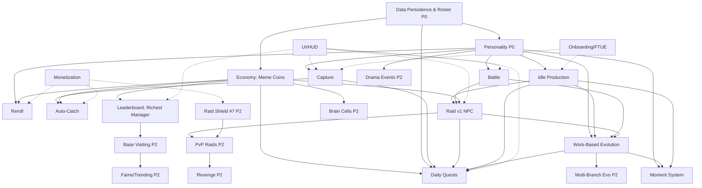

# Systems Index — Brainrot Inc.

**Last Updated**: 2026-05-26
**Author**: game-designer
**Status**: Draft (pre-production system map)

> **Revision note (2026-05-26):** Added **Daily Quests** as MVP system **#17** (retention/objective layer). Phase 2 systems renumbered #17–23 → **#18–24**. Summary, build order, dependency graphs, and all by-number cross-references updated.

> **Revision note (2026-05-26):** **Raid Shield (#7) moved MVP → Phase 2** (Raid v1 is offense-only — there is nothing attacking you in v1, so a shield has no function until PvP #18). **System number #7 is retained as a stable identifier** to avoid churn in the many by-number cross-references across the GDDs — only its phase/priority changed (MVP/P2 → Phase 2/P3). Summary counts, build order, and both dependency graphs updated; Defense Rating display stays in Raid v1 (owned by Raid #6).

## Summary

- Total systems: 24 (16 MVP, 8 Phase 2)
- Not started: 24
- In design: 0
- In implementation: 0
- Implemented: 0
- Polished: 0
- Live: 0

**Legend** — Priority tiers: P0 = foundation/blocker, P1 = core MVP, P2 = MVP-supporting, P3 = Phase 2. Risk: L/M/H. Phase tag in each block.

**World context**: Setting = "The Feed" (internet-as-place). Hub zone = "Downtown Scroll". Raid v1 targets = 4 NPC "Rival Startups" (Grind Corp, Chill Collective, The Glitch Gang, Pivot Ventures); boss-tier rival "Burnout Inc." deferred to Phase 2. See world-bible / Master GDD for narrative detail.

---

## Systems

### 1. Data Persistence & Roster Core
- **Status**: Not started
- **Phase**: MVP
- **Priority**: P0 (foundation)
- **Value**: 5 | **Effort**: 4 | **Risk**: H | **Monetization**: 3
- **GDD**: `design/gdd/persistence-gdd.md` (planned)
- **Depends On**: (none — foundation)
- **Depended On By**: nearly everything (Personality, Idle Production, Capture, Battle, Raid, Evolution, Economy, Auto-Catch, Reroll, Leaderboard)
- **Notes**: GUID per Brainrot; roster cap 200; DataStore for owned roster + currency + progression; MemoryStore for ephemeral cross-server state (raid shield, matchmaking pool, raid mailbox). Server-authoritative clock for all idle/shield timers (never trust client time). High risk: schema must be versioned/migratable on day one or every later system inherits debt. Config-driven: cap values, key names, retry/backoff in a Persistence config.

### 2. Personality System (PILLAR)
- **Status**: Not started
- **Phase**: MVP
- **Priority**: P0 (pillar — gates flavor of all other systems)
- **Value**: 5 | **Effort**: 3 | **Risk**: M | **Monetization**: 4
- **GDD**: `design/gdd/personality-gdd.md` (planned)
- **Depends On**: Data Persistence (stores personality field per GUID)
- **Depended On By**: Idle Production, Battle, Raid, Evolution, Moment System, Reroll, Drama Events (P2), Fame (P2)
- **Notes**: 5 types: Hyper / Lazy / Chaotic / Loyal / Rebel. This is a shared modifier layer, not a self-contained feature — implement as a config-driven trait table (production multipliers, battle behavior hooks) that other systems read. Zero magic numbers: every multiplier (Hyper +30%, Lazy -50%, etc.) lives in a PersonalityConfig table. Build the data + trait-table first; behavior wiring lands as each consumer system is built.

### 3. Idle Production (Online + Offline)
- **Status**: Not started
- **Phase**: MVP
- **Priority**: P1 (core loop)
- **Value**: 5 | **Effort**: 3 | **Risk**: M | **Monetization**: 4
- **GDD**: `design/gdd/idle-production-gdd.md` (planned)
- **Depends On**: Data Persistence, Personality, Economy (deposits Meme Coins)
- **Depended On By**: Raid (steals uncollected production), Evolution (production milestones), Moment System
- **Notes**: Online + offline accrual, offline cap 8 hours, server-clock only, pending-collect model (resources accrue into a pending pool, player taps to collect). Personality modifies rate (Hyper faster w/ random breaks, Lazy slower + morale aura, Chaotic 2x/0x per cycle, Loyal steady, Rebel strike risk). All rates/caps config-driven. AFK-safe by design (idle is the default state). Core revenue surface (collection-speed/cap GamePasses later).

### 4. Capture (Explore + Manual Catch)
- **Status**: Not started
- **Phase**: MVP
- **Priority**: P1 (core loop entry point)
- **Value**: 5 | **Effort**: 5 | **Risk**: H | **Monetization**: 3
- **GDD**: `design/gdd/capture-gdd.md` (planned)
- **Depends On**: Data Persistence, Personality (capture assigns/reveals personality)
- **Depended On By**: Roster growth feeds Idle Production, Battle, Raid, Evolution
- **Notes**: Single hub zone ("Downtown Scroll") + config-driven spawn table + timing mini-game, server-authoritative resolution (client sends intent, server validates spawn ownership + timing window). **Scope risk (solo dev): exploration-map capture is the single highest-effort MVP item.** Fallback if behind schedule: replace free-roam capture with a "crate/encounter" UI (tap-to-encounter → same timing mini-game) — preserves the personality-reveal moment without map/streaming cost. Flag this decision early (lock by build step 5).

### 5. Battle System (Auto, Turn-Based, Spectatable)
- **Status**: Not started
- **Phase**: MVP
- **Priority**: P1 (core combat, blocks Raid)
- **Value**: 5 | **Effort**: 4 | **Risk**: H | **Monetization**: 2
- **GDD**: `design/gdd/battle-gdd.md` (planned)
- **Depends On**: Data Persistence, Personality (battle modifiers), Roster (combatants)
- **Depended On By**: Raid (raid uses battle resolution), Evolution (raid-survival milestones)
- **Notes**: Auto turn-based; player spectates live. Personality drives behavior (Hyper attacks first / 20% mistarget, Lazy berserk-when-last, Chaotic random move, Loyal bodyguard <30% HP, Rebel double-damage counter). Server-authoritative resolution; client is a replay/viewer. All damage/turn formulas config-driven (explicit formula required in GDD, no "calculated appropriately"). Risk H: turn engine + personality hooks + deterministic replay is the most logic-heavy system.

### 6. Raid v1 (vs NPC Rival Startups)
- **Status**: Not started
- **Phase**: MVP
- **Priority**: P1 (social engine surrogate at launch)
- **Value**: 4 | **Effort**: 4 | **Risk**: M | **Monetization**: 3
- **GDD**: `design/gdd/raid-gdd.md` (planned)
- **Depends On**: Battle, Personality, Idle Production (loot = % of target's uncollected), Economy (raid cost), Data Persistence + MemoryStore (raid mailbox). *(Raid Shield is NOT an MVP dependency — Raid v1 is offense-only; shield is Phase 2, see #7.)*
- **Depended On By**: Evolution (raid milestones), Revenge System (P2)
- **Notes**: v1 targets are config-defined NPC "Rival Startups" (4 at launch: Grind Corp, Chill Collective, The Glitch Gang, Pivot Ventures) — no live PvP yet, which de-risks matchmaking and griefing for launch while still exercising the full battle + loot pipeline. **Raid v1 is offense-only** (you raid NPCs; nothing raids you), so the Raid Shield is deferred to Phase 2 (#7) — but the **Defense Rating display stays in v1** (owned here, Raid #6). Send team of 3, win = steal % of NPC pool (or apply to defense scoring). PvP + Revenge + boss-tier rival (Burnout Inc.) + Raid Shield deferred to Phase 2. Raid cost/loot %/team size config-driven.

### 8. Work-Based Evolution (MVP: 1 stage/personality)
- **Status**: Not started
- **Phase**: MVP
- **Priority**: P2 (long-term hook)
- **Value**: 4 | **Effort**: 3 | **Risk**: M | **Monetization**: 2
- **GDD**: `design/gdd/evolution-gdd.md` (planned)
- **Depends On**: Data Persistence (tracks lifetime stats per GUID), Personality, Idle Production / Battle / Raid (milestone sources)
- **Depended On By**: Moment System (evolution as a moment), Fame (P2), Multi-Branch Evolution (P2)
- **Notes**: MVP = single milestone → single evolved stage per personality (e.g., Hyper→Senior Hyper at lifetime production X; Rebel→Revolutionary at N raids survived; Loyal→Guardian at N defends). Requires lifetime-stat counters wired from day one (cheap to add now, expensive to backfill). Multi-branch evolution → Phase 2. Milestone thresholds config-driven.

### 9. Economy / Currency (Meme Coins)
- **Status**: Not started
- **Phase**: MVP
- **Priority**: P1 (currency backbone)
- **Value**: 4 | **Effort**: 2 | **Risk**: M | **Monetization**: 4
- **GDD**: `design/gdd/economy-gdd.md` (planned) — delegate detailed sink/source model to economy-designer
- **Depends On**: Data Persistence
- **Depended On By**: Raid (cost), Reroll, Auto-Catch unlock, Shop/Upgrades, Moment System, Leaderboard
- **Notes**: Single soft currency "Meme Coins" at launch. `gems` field provisioned in schema, default 0, unused at launch (forward-compat, no UI). Premium "Brain Cells" → Phase 2. All earn/spend values config-driven; server-authoritative balance mutations only. Delegate full source/sink tuning to economy-designer.

### 10. Auto-Catch (Hybrid: free unlock + GamePass upgrade)
- **Status**: Not started
- **Phase**: MVP
- **Priority**: P2 (convenience / monetization)
- **Value**: 3 | **Effort**: 3 | **Risk**: M | **Monetization**: 4
- **GDD**: `design/gdd/auto-catch-gdd.md` (planned)
- **Depends On**: Capture, Data Persistence (catch counter), Monetization (GamePass tier), Economy
- **Notes**: Hybrid — free basic auto-catch unlocks at ~50 manual captures (rewards engagement, not pay-to-skip); GamePass upgrades speed/quality. **Not default on day 1** — manual capture must be experienced first so personality-reveal lands and FTUE teaches the mini-game. Auto-catch still shows reveals (batched feed); rare pulls interrupt for a manual celebratory reveal. Unlock threshold + rates config-driven.

### 11. Reroll Personality
- **Status**: Not started
- **Phase**: MVP
- **Priority**: P2 (depth + monetization)
- **Value**: 3 | **Effort**: 2 | **Risk**: L | **Monetization**: 4
- **GDD**: `design/gdd/reroll-gdd.md` (planned)
- **Depends On**: Personality, Economy (Meme Coins cost), Monetization (optional Robux path), Data Persistence
- **Notes**: Capped escalating Meme Coins cost curve (250/600/1200/2000 cap, resets after 24h) + optional Robux shortcut. **Odds must be displayed** (compliance + trust). Server rolls the result authoritatively (UpdateAsync atomic + idempotency key, anti-dupe). Cost curve, cap, and per-personality probabilities all config-driven and shown in UI.

### 12. Moment System (Online burst events + Offline recap reel)
- **Status**: Not started
- **Phase**: MVP
- **Priority**: P2 (the "personality is visible" payoff)
- **Value**: 4 | **Effort**: 3 | **Risk**: M | **Monetization**: 1
- **GDD**: `design/gdd/moment-system-gdd.md` (planned)
- **Depends On**: Personality, Idle Production, Battle/Raid + Evolution (moment sources), Data Persistence (logs moments for recap)
- **Notes**: Online = periodic personality "burst" events surfaced in base (lightweight, event-driven, not per-frame sim — the viral/shareable hook). Offline = recap reel on return ("while you were gone..."). This is the surface that makes the pillar *felt* rather than just numerical — protect it from being cut, but it can ship minimal (text/icon pop-ups) and grow. One moment highlighted at a time (clarity for kids). Distinct from Drama Events (P2): Moments are display/notification; Drama is interactive choice. Event frequency/weighting config-driven.

### 13. UI / HUD
- **Status**: Not started
- **Phase**: MVP
- **Priority**: P1 (every system needs a surface)
- **Value**: 4 | **Effort**: 4 | **Risk**: M | **Monetization**: 2
- **GDD**: `design/gdd/ui-hud-gdd.md` (planned)
- **Depends On**: Economy (currency display), Roster, most systems (each contributes a panel)
- **Depended On By**: Capture, Battle (spectate view), Raid, Reroll, Daily Rewards, Codes, Shop, Settings, Leaderboard
- **Notes**: HUD (currency, roster count, collect button), roster/management panel, battle spectate view, raid screen, moment pop-ups, leaderboard panel. Build incrementally alongside each consumer system rather than all at once. Mobile-first, pure presentation — reads state, fires intent Remotes.

### 14. Onboarding / FTUE
- **Status**: Not started
- **Phase**: MVP
- **Priority**: P1 (Roblox first-5-minutes retention)
- **Value**: 5 | **Effort**: 3 | **Risk**: M | **Monetization**: 1
- **GDD**: `design/gdd/onboarding-gdd.md` (planned)
- **Depends On**: Capture, Personality, Idle Production, Economy, UI/HUD
- **Notes**: Guided first capture → reveal personality → deploy → first collect → soft raid intro, with an immediate reward inside the first session. Guide character ("Incubator HQ mentor") gives one instruction at a time; exactly one glowing objective beacon at all times. Must teach the capture mini-game before Auto-Catch is available. Build after core loop systems are functional (it scripts a path *through* them). Step thresholds/rewards config-driven.

### 15. Monetization (GamePass + DevProduct, zero P2W)
- **Status**: Not started
- **Phase**: MVP
- **Priority**: P1 (launch revenue, but non-blocking to core loop)
- **Value**: 3 | **Effort**: 3 | **Risk**: M | **Monetization**: 5
- **GDD**: `design/gdd/monetization-gdd.md` (planned)
- **Depends On**: Data Persistence, Economy, Auto-Catch, Reroll (the things being sold). *(Raid Shield #7 is Phase 2, so the extended-shield product is a Phase-2 SKU, not a launch SKU.)*
- **Notes**: GamePasses + DevProducts, strict zero pay-to-win (critical: nothing that boosts raid combat power). Launch SKUs: Auto-Catch upgrade, 2x offline earnings, Reroll Robux path, extra Brainrot slots, VIP cosmetics. **Extended Raid Shield (capped) is a Phase-2 SKU** (Raid Shield #7 moved to Phase 2 — no shield function in offense-only Raid v1). Receipt processing must be idempotent + server-authoritative (ProcessReceipt). Product IDs + grants config-driven. Wire after the underlying systems exist.

### 16. Leaderboard (Richest Manager)
- **Status**: Not started
- **Phase**: MVP
- **Priority**: P2 (light social competition + early retention)
- **Value**: 3 | **Effort**: 2 | **Risk**: L | **Monetization**: 1
- **GDD**: `design/gdd/leaderboard-gdd.md` (planned)
- **Depends On**: Data Persistence, Economy (net worth source)
- **Depended On By**: (none in MVP); generalizes into Fame/Trending leaderboard infra (P2)
- **Notes**: Single global leaderboard ranking players by total wealth ("Richest Manager"). Backed by OrderedDataStore; update on collect/save (debounced), not per-tick. Low effort, low risk — pulled forward from Phase 2 for early social hook without full Fame infra. Define "net worth" metric (lifetime coins earned vs current balance) in GDD. Top-N display config-driven. Lays the leaderboard plumbing that Fame/Trending (P2) reuses.

### 17. Daily Quests (Objectives)
- **Status**: Not started
- **Phase**: MVP
- **Priority**: P2 (retention / objective layer)
- **Value**: 3 | **Effort**: 3 | **Risk**: M | **Monetization**: 2
- **GDD**: `design/gdd/daily-quests-gdd.md` (planned)
- **Depends On**: Economy (#9, reward payout), Data Persistence (#1, progress tracking + daily reset state), and objective sources Capture (#4), Raid (#6), Idle Production (#3), Work-Based Evolution (#8)
- **Depended On By**: (none in MVP)
- **Notes**: Gives players a short daily set of goals so a 15–30 min session has direction beyond pure idle. **3 daily quests** rolled at reset from a config-driven pool (examples: "tangkap N Brainrot", "menang M raid", "kumpulkan X coins", "evolve 1 Brainrot"); progress accrues from the objective-source systems' events (event-driven, not polling). On completion of a quest, reward = Meme Coins via Economy faucet `quest_daily` (reward pool is per-quest config, not a flat magic number — see economy-gdd §3.1/§8.2). **Daily RESET on server-clock** (never trust client time): store `lastQuestReset` + the active quest set + per-quest progress in PlayerData (coordinate with Persistence schema; reset = re-roll the 3 quests + zero progress when server-clock day boundary crossed). Quest pool, count (3), per-quest targets, and reward ranges are all config-driven. Risk M: cross-server-consistent daily reset + multi-source progress tracking is the moving part; lean on Persistence's server-clock + atomic mutation path. **Scope note (solo dev MVP addition):** this is a late add to MVP scope — a **prune candidate** if launch schedule slips. Fallback if cut: a simple escalating daily-login reward (no objectives), which still feeds the `quest_daily` faucet. Needs its own GDD: `design/gdd/daily-quests-gdd.md` (planned).

---

### Phase 2 Systems

### 7. Raid Shield
*(number retained as stable identifier; phase moved to Phase 2)*
- **Status**: Not started
- **Phase**: Phase 2
- **Priority**: P3 (anti-grief, paired with PvP)
- **Value**: 3 | **Effort**: 2 | **Risk**: M | **Monetization**: 3
- **GDD**: `design/gdd/raid-shield-gdd.md` (planned)
- **Depends On**: Data Persistence + MemoryStore (shield expiry, cross-server), PvP Raids (#18)
- **Depended On By**: PvP Raids (#18, checks shield before allowing), Monetization (extended-shield product)
- **Notes**: **Deferred to Phase 2 alongside PvP Raids (#18)** — in Raid v1 (offense-only NPC raids) the shield has **no function** (nothing attacks you, so there is nothing to shield against). It slots in cleanly when live PvP arrives. **System number #7 is retained as a stable identifier** (used as a by-number cross-reference across the GDDs) — only its phase/priority moved. Free 4-hour shield baseline (sacred — never paywalled as the only option); server-clock expiry stored in MemoryStore so it holds across server hops. The **Defense Rating display** ships in Raid v1 already (owned by Raid #6); only the shield mechanic itself is Phase 2. Durations/cost config-driven.

### 18. PvP Raids (Live Player Targets)
- **Status**: Not started — **Phase**: Phase 2 — **Priority**: P3
- **Value**: 5 | **Effort**: 5 | **Risk**: H | **Monetization**: 3
- **Depends On**: Raid v1, Battle, MemoryStore matchmaking pool, Raid Shield (#7, Phase 2), Personality
- **Notes**: Replaces/extends NPC targets with real player bases + boss-tier rival (Burnout Inc.). Highest social value, highest risk (matchmaking, fairness, griefing, offline-defense correctness). v1 NPC raids are the de-risking runway.

### 19. Revenge System
- **Status**: Not started — **Phase**: Phase 2 — **Priority**: P3
- **Value**: 4 | **Effort**: 3 | **Risk**: M | **Monetization**: 2
- **Depends On**: PvP Raids, MemoryStore (raid mailbox), Economy
- **Notes**: 2x-reward counter-raid quest within 24h. Creates ping-pong retention loop. Requires PvP first.

### 20. Multi-Branch Evolution
- **Status**: Not started — **Phase**: Phase 2 — **Priority**: P3
- **Value**: 4 | **Effort**: 3 | **Risk**: M | **Monetization**: 2
- **Depends On**: Work-Based Evolution (MVP), lifetime-stat counters
- **Notes**: Multiple evolution paths per personality based on play history. Cheap *if* lifetime counters were built in MVP (see systems 1 & 8).

### 21. Premium Currency (Brain Cells)
- **Status**: Not started — **Phase**: Phase 2 — **Priority**: P3
- **Value**: 2 | **Effort**: 2 | **Risk**: M | **Monetization**: 5
- **Depends On**: Economy, Monetization, Data Persistence
- **Notes**: Second hard currency. Schema field pre-provisioned now (default 0). Maintain zero-P2W stance.

### 22. Fame / Trending System
- **Status**: Not started — **Phase**: Phase 2 — **Priority**: P3
- **Value**: 4 | **Effort**: 4 | **Risk**: H | **Monetization**: 2
- **Depends On**: Personality, Battle/Raid + Idle Production (fame sources), Base Visiting, Leaderboard infra (MVP), Data Persistence
- **Notes**: Fame points → "Trending" status (+25% output, fan NPCs), cross-base Likes, global Trending leaderboard. Reuses MVP Leaderboard plumbing + requires base-visiting + cross-server aggregation — hence H risk.

### 23. Drama Events (Interactive Choice Events)
- **Status**: Not started — **Phase**: Phase 2 — **Priority**: P3
- **Value**: 3 | **Effort**: 2 | **Risk**: L | **Monetization**: 2
- **Depends On**: Personality, Idle Production, Economy (some choices cost coins), Moment System
- **Notes**: Two-choice pop-ups triggered by personality combos. Low cost, high flavor. Distinct from MVP Moment System (interactive vs display-only). Event table config-driven.

### 24. Base Visiting / Social Lobby
- **Status**: Not started — **Phase**: Phase 2 — **Priority**: P3
- **Value**: 3 | **Effort**: 4 | **Risk**: H | **Monetization**: 1
- **Depends On**: Data Persistence (load another player's base read-only), MemoryStore, Roster
- **Notes**: Prerequisite for Fame Likes. Loading/rendering another player's base safely (read-only, anti-exploit) is non-trivial — gates Fame.

---

## Dependency Graph

```
                    ┌─────────────────────────────┐
                    │  Data Persistence & Roster  │  (P0 foundation)
                    └──────────────┬──────────────┘
                                   │
                    ┌──────────────▼──────────────┐
                    │   Personality System (P0)   │  (pillar trait layer)
                    └──┬────────┬────────┬─────┬──┘
                       │        │        │     │
          ┌────────────┘        │        │     └──────────────┐
          ▼                     ▼        ▼                     ▼
   ┌────────────┐        ┌──────────┐ ┌─────────┐      ┌────────────┐
   │  Capture   │        │   Idle   │ │ Battle  │      │   Reroll   │
   │ (explore)  │        │Production│ │(auto TB)│      │            │
   └─────┬──────┘        └────┬─────┘ └────┬────┘      └─────┬──────┘
         │                    │            │                 │
         │   ┌────────────────┤            ▼                 │
         │   │                │       ┌─────────┐            │
         ▼   ▼                │       │ Raid v1 │◄───────────┤ (cost)
   ┌──────────┐               │       │ (NPC)   │            │
   │Auto-Catch│               │       └──┬──────┘            ▼
   └──────────┘               │          │             ┌──────────┐
                              │          │             │ Economy  │──► Leaderboard
                              │          │             │(MemeCoin)│   (Richest Mgr)
                              │          │             └────┬─────┘
                              │          │                  │
                              ▼          ▼                  │
                        ┌──────────────────┐               │
                        │ Work-Based Evo    │◄──────────────┘
                        │ (lifetime stats)  │
                        └─────────┬─────────┘
                                  ▼
                        ┌──────────────────┐
                        │  Moment System    │
                        └──────────────────┘

   ┌──────────────────────────────────────────────────────────────┐
   │ Daily Quests (#17, MVP)                                        │
   │   reward  ◄── Economy (Meme Coins faucet quest_daily)          │
   │   tracking/reset ◄── Data Persistence (lastQuestReset+progress,│
   │                       server-clock daily reset)                │
   │   progress from objective sources: Capture, Raid, Idle, Evo    │
   │   cross-cutting with UI/HUD (quest panel)                      │
   └──────────────────────────────────────────────────────────────┘

   Cross-cutting (depend on many): UI/HUD, Onboarding/FTUE, Monetization, Daily Quests

   ── Phase 2 ──────────────────────────────────────────────
   Raid v1 ──► PvP Raids (+ Burnout Inc. boss) ──► Revenge System
                  ▲
   Raid Shield (#7) ─┘  (defends against live attackers; no function in offense-only Raid v1)
   Evolution ──► Multi-Branch Evolution
   Economy/Monetization ──► Premium Currency (Brain Cells)
   Leaderboard + Data Persistence ──► Base Visiting ──► Fame/Trending
   Personality + Moment ──► Drama Events
```



---

## Priority List (recommended build order — solo dev)

Foundation-first; each step unlocks the next. MVP target launch July 2026.

1. **Data Persistence & Roster Core** — nothing works without GUID schema, roster cap, server clock, MemoryStore. Build versioned/migratable from day one. Wire lifetime-stat counters now (cheap; enables Evolution + Phase 2 multi-branch later).
2. **Personality System (trait-table layer)** — pillar. Data field + config trait table first; behavior hooks land as consumers are built.
3. **Economy / Currency (Meme Coins)** — currency backbone many systems spend/earn against. Pre-provision `gems` field (default 0).
4. **Idle Production (online + offline)** — first half of the core loop; the AFK-safe default state. Validates server-clock + pending-collect early.
5. **Capture** — second half of core loop and roster growth. **Highest scope risk: decide explore-map vs crate-fallback before committing.** Lock that call here.
6. **UI / HUD (incremental)** — start now and grow per system; needed to make capture + idle playable/testable.
7. **Battle System** — logic-heavy; required before raids. Build deterministic server-authoritative turn engine + personality hooks.
8. **Raid v1 (NPC Rival Startups)** — exercises battle + loot pipeline without PvP risk. *(Raid Shield is Phase 2 — Raid v1 is offense-only; see #7.)*
9. **Work-Based Evolution (1 stage/personality)** — long-term hook; consumes the lifetime counters from step 1.
10. **Moment System** — surfaces the pillar; ship minimal (pop-ups + recap), then enrich.
11. **Reroll Personality** — small, high monetization; needs Personality + Economy (done) + odds-display UI.
12. **Leaderboard (Richest Manager)** — small OrderedDataStore system; light social hook. Slots in once Economy + Persistence are stable.
13. **Daily Quests (objectives)** — slots in here because its objective sources (Capture, Raid, Idle, Evolution) and its reward backbone (Economy) are now all functional, so quests can hook real progress events and pay out via the `quest_daily` faucet. Needs the server-clock daily reset + `lastQuestReset`/progress fields in PlayerData (Persistence). **Late MVP scope add (solo dev) — prune candidate if July 2026 slips; fallback = simple escalating daily-login reward feeding the same faucet.**
14. **Auto-Catch (hybrid)** — convenience; gate behind ~50 manual catches, not default day 1.
15. **Onboarding / FTUE** — script the guided path through the now-functional core loop; first-5-minutes retention. Can surface the first daily quest as an early objective once Daily Quests exists.
16. **Monetization (GamePass + DevProduct)** — wire SKUs onto Auto-Catch, Shield, Reroll, convenience; idempotent ProcessReceipt. Non-blocking to loop, so late but pre-launch.

**Phase 2 (post-launch), rough order:** Raid Shield (#7, paired with PvP — defends against live attackers) → PvP Raids (+ Burnout Inc. boss) → Revenge System → Drama Events → Fame/Trending (reuses MVP Leaderboard infra + needs Base Visiting) → Multi-Branch Evolution → Premium Currency (Brain Cells).
